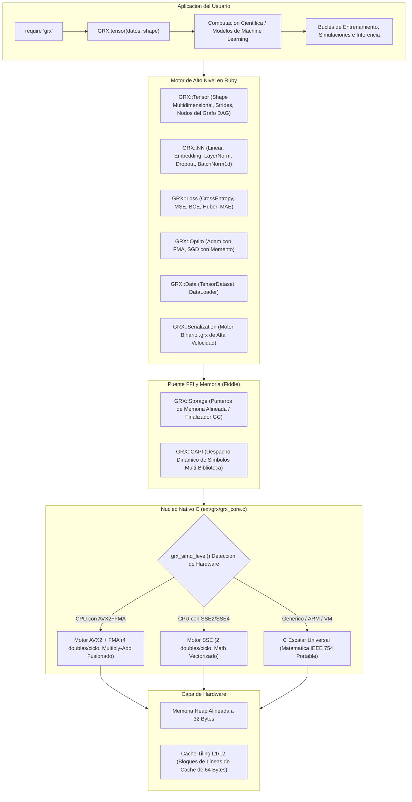
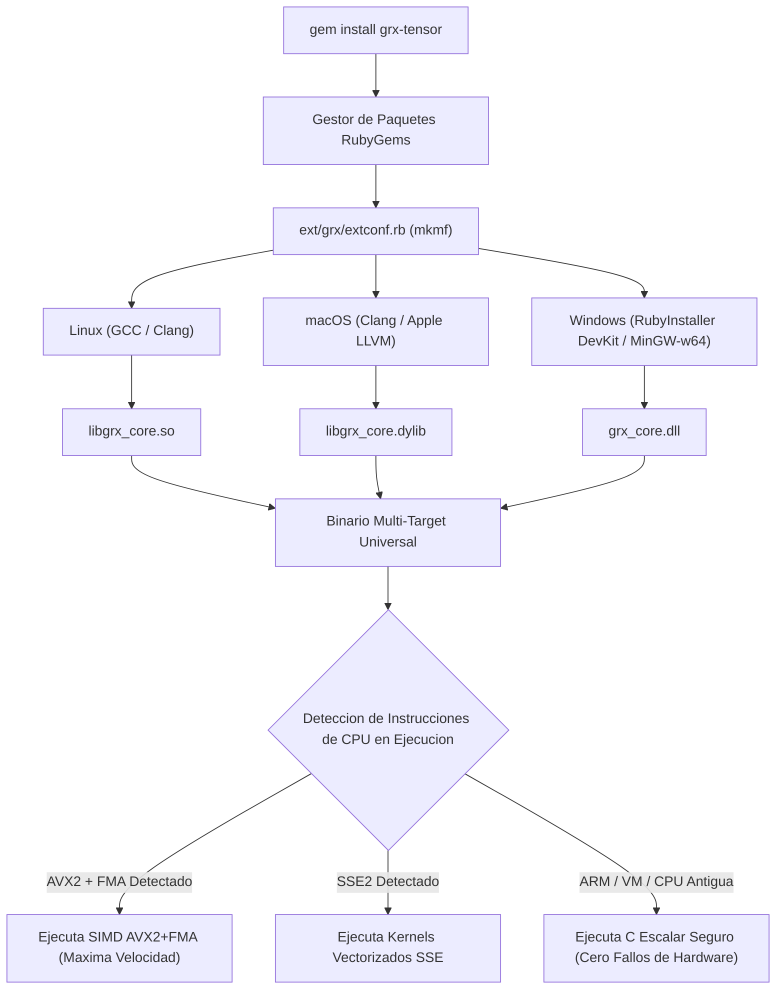
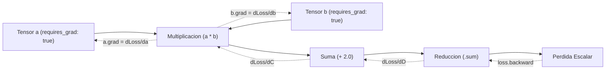

# GRX-Tensor

**Ruby habla. C calcula.**

Un framework de computacion cientifica, procesamiento tensorial multidimensional y Deep Learning de alto rendimiento para Ruby. Cuenta con diferenciacion automatica (Autograd), aceleracion de hardware multi-target SIMD dinamica (AVX2+FMA, SSE y escalar C portable), y primitivas completas para redes neuronales, todo respaldado por una API de Ruby limpia, intuitiva y expresiva.

[](https://www.ruby-lang.org)
[](LICENSE.txt)
[](https://github.com/Gabo-Razo/grx-tensor)

---

## Flujo Arquitectonico del Sistema



---

## Compilacion Universal y Despacho Dinamico de Hardware



---

## Tabla de Contenido

1. [Caracteristicas Principales](#caracteristicas-principales)
2. [Instalacion](#instalacion)
3. [Tutoriales Basicos de Inicio Rapido](#tutoriales-basicos-de-inicio-rapido)
   - [1. Conversor de Grados Celsius a Fahrenheit](#1-conversor-de-grados-celsius-a-fahrenheit-1-neurona-aprende-f--18c--32)
   - [2. Compuertas Logicas (AND y XOR)](#2-compuertas-logicas-and-lineal-vs-xor-no-lineal-con-relu-y-sigmoide)
   - [3. Matematicas Tensoriales Cotidianas](#3-matematicas-tensoriales-cotidianas-en-4-lineas)
4. [Manual de Referencia del API de Tensores](#manual-de-referencia-del-api-de-tensores)
5. [Autograd y Motor de Diferenciacion](#autograd-y-motor-de-diferenciacion)
6. [Computacion Cientifica y Numerica (Mas Alla del Deep Learning)](#computacion-cientifica-y-numerica-mas-alla-del-deep-learning)
   - [A. Vision por Computadora y Filtrado de Imagenes (Convolucion Sobel)](#a-vision-por-computadora-y-filtrado-de-imagenes-convolucion-sobel)
   - [B. Finanzas Cuantitativas y Matriz de Covarianza](#b-finanzas-cuantitativas-y-matriz-de-covarianza)
   - [C. Fisica de Particulas y Simulacion N-Cuerpos](#c-fisica-de-particulas-y-simulacion-n-cuerpos)
   - [D. Optimizacion Matematica Pura con Autograd (Funcion Rosenbrock)](#d-optimizacion-matematica-pura-con-autograd-funcion-rosenbrock)
7. [Recetario de Deep Learning (10 Arquitecturas de Redes Neuronales)](#recetario-de-deep-learning-10-arquitecturas-de-redes-neuronales)
   - [Arquitectura 1: Clasificador de Vision y Caracteres (BatchNorm + Dropout)](#arquitectura-1-clasificador-de-vision-y-caracteres-batchnorm--dropout)
   - [Arquitectura 2: NLP y Chatbot de Intenciones (Embedding + LayerNorm)](#arquitectura-2-nlp-y-chatbot-de-intenciones-embedding--layernorm)
   - [Arquitectura 3: Aprendizaje por Refuerzo (Agente Deep Q-Network DQN)](#arquitectura-3-aprendizaje-por-refuerzo-agente-deep-q-network-dqn)
   - [Arquitectura 4: Pronostico No Lineal de Series Temporales Multivariables](#arquitectura-4-pronostico-no-lineal-de-series-temporales-multivariables)
   - [Arquitectura 5: Autoencoder Profundo para Reduccion Dimensional y Deteccion de Anomalias](#arquitectura-5-autoencoder-profundo-para-reduccion-dimensional-y-deteccion-de-anomalias)
   - [Arquitectura 6: Modelo Generador de Lenguaje y Siguiente Caracter Autoregresivo](#arquitectura-6-modelo-generador-de-lenguaje-y-siguiente-caracter-autoregresivo)
   - [Arquitectura 7: Analisis de Sentimiento y Clasificacion de Resenas (BCELoss)](#arquitectura-7-analisis-de-sentimiento-y-clasificacion-de-resenas-bceloss)
   - [Arquitectura 8: Red Neuronal Siamesa para Verificacion de Similitud y Firmas](#arquitectura-8-red-neuronal-siamesa-para-verificacion-de-similitud-y-firmas)
   - [Arquitectura 9: Red Residual Profunda (Bloque ResNet MLP con Conexion Skip)](#arquitectura-9-red-residual-profunda-bloque-resnet-mlp-con-conexion-skip)
   - [Arquitectura 10: Filtrado Colaborativo Neuronal y Sistema de Recomendacion](#arquitectura-10-filtrado-colaborativo-neuronal-y-sistema-de-recomendacion)
8. [Funciones de Perdida (GRX::Loss)](#funciones-de-perdida-grxloss)
9. [Guia de Notacion Cientifica y Parametros](#guia-de-notacion-cientifica-y-parametros)
   - [1. Que significa la Notacion Cientifica en Machine Learning (1e-1 a 1e-8)?](#1-que-significa-la-notacion-cientifica-en-machine-learning-1e-1-a-1e-8)
   - [2. Parametros de Capas Neuronales (GRX::NN)](#2-parametros-de-capas-neuronales-grxnn)
10. [Catalogo de Optimizadores e Hiperparametros (GRX::Optim)](#catalogo-de-optimizadores-e-hiperparametros-grxoptim)
11. [Pipelines de Datos y DataLoader (GRX::Data)](#pipelines-de-datos-y-dataloader-grxdata)
12. [Persistencia de Modelos y Cerebros (Formato .grx)](#persistencia-de-modelos-y-cerebros-formato-grx)
    - [Especificacion del Formato Binario GRX1](#especificacion-del-formato-binario-grx1)
    - [Flujo de Despliegue de Inferencia en Produccion](#flujo-de-despliegue-de-inferencia-en-produccion)
13. [Gestion de Gradientes y Utilidades (GRX::Utils)](#gestion-de-gradientes-y-utilidades-grxutils)
14. [Guia de Soporte y Herramientas para Windows](#guia-de-soporte-y-herramientas-para-windows)
15. [Licencia](#licencia)

---

## Caracteristicas Principales

| Caracteristica | Especificacion |
|---|---|
| **Motor SIMD Multi-Target** | Deteccion dinamica en ejecucion: AVX2+FMA, SSE o escalar C portable |
| **Memoria Heap Alineada** | Asignacion en heap alineada a 32 bytes (`posix_memalign` / `_aligned_malloc`) |
| **Vistas Zero-Copy** | Transformaciones geometricas por zancadas (`reshape`, `transpose`, `flatten`, `t`) |
| **Motor Autograd** | Diferenciacion automatica en modo inverso con retropropagacion dinamica de DAG |
| **Capas Neuronales** | `Linear`, `Sequential`, `Embedding`, `LayerNorm`, `BatchNorm1d`, `Dropout` |
| **Funciones de Activacion** | `ReLU`, `LeakyReLU`, `Sigmoid`, `Tanh`, `Softmax` (totalmente diferenciables) |
| **Funciones de Perdida** | `MSELoss`, `MAELoss`, `BCELoss`, `CrossEntropyLoss`, `HuberLoss` |
| **Optimizadores** | `Adam` (vectorizado en C con FMA y correccion de sesgo), `SGD` (con momento y decay) |
| **Persistencia Binaria** | Formato `.grx` ultrarrapido para guardar y cargar pesos al instante |
| **Pipelines de Datos** | `TensorDataset` y `DataLoader` con division en lotes (*batching*) y barajado (*shuffle*) |
| **Inicializadores de Pesos** | Xavier uniforme y He normal (xorshift64* y Box-Muller en C) |
| **Multiplataforma** | Linux (`.so`), macOS (`.dylib`), Windows (`.dll` mediante DevKit) |
| **Fallback en Ruby Puro** | Ejecuta fluidamente en Ruby puro si el compilador de C no esta presente |

---

## Instalacion y Configuracion del Entorno

GRTensor requiere Ruby ($\ge 3.0$) y herramientas de compilacion en C (`gcc`, `make` y cabeceras de desarrollo de Ruby) para compilar el nucleo de aceleracion SIMD nativo.

### 1. Instalar Ruby y Dependencias de Compilacion por Sistema Operativo / Distribucion

#### Debian, Ubuntu, Linux Mint, Pop!_OS, Kali Linux
```bash
sudo apt update
sudo apt install -y ruby-full ruby-dev build-essential make gcc
```

#### Fedora, Red Hat Enterprise Linux (RHEL), CentOS, Rocky Linux, AlmaLinux
* **Fedora:**
  ```bash
  sudo dnf install -y ruby ruby-devel gcc make redhat-rpm-config
  ```
* **RHEL / CentOS / Rocky Linux / AlmaLinux:**
  ```bash
  sudo dnf install -y epel-release
  sudo dnf groupinstall -y "Development Tools"
  sudo dnf install -y ruby ruby-devel
  ```

#### Arch Linux, Manjaro, EndeavourOS
```bash
sudo pacman -Syu --noconfirm ruby base-devel
```

#### openSUSE / SUSE Linux Enterprise
```bash
sudo zypper refresh
sudo zypper install -y ruby ruby-devel gcc make
```

#### macOS (Homebrew)
```bash
brew install ruby
# Asegura que el Ruby de Homebrew este en tu PATH:
echo 'export PATH="$(brew --prefix ruby)/bin:$PATH"' >> ~/.zshrc
source ~/.zshrc
```

#### Windows (PowerShell / Simbolo del Sistema)
* **Opcion A: Mediante Windows Terminal / PowerShell con `winget` (Recomendado):**
  ```powershell
  winget install RubyInstallerTeam.RubyWithDevKit.3.3
  ```
  *Al finalizar la instalacion, abre una nueva ventana de PowerShell y completa el toolchain MSYS2 DevKit:*
  ```powershell
  ridk install 3
  ```
* **Opcion B: Mediante Chocolatey:**
  ```powershell
  choco install ruby --version=3.3.0 -y
  ridk install 3
  ```
* **Opcion C: Instalador Web Directo (GUI):**
  1. Descarga el instalador **Ruby+Devkit** (x64) mas reciente desde [https://rubyinstaller.org/downloads/](https://rubyinstaller.org/downloads/).
  2. Sigue el asistente de instalacion y asegurate de marcar la casilla para instalar el **toolchain MSYS2 DevKit**.

---

### 2. Instalar la Gema `grx-tensor`

Una vez instalado Ruby, ejecuta en tu terminal:

```bash
gem install grx-tensor
```

O agregalo al `Gemfile` de tu aplicacion:

```ruby
gem "grx-tensor", "~> 0.2.1"
```

La extension nativa en C se compila y enlaza de forma automatica y transparente durante la instalacion.

---

### 3. Verificar la Instalacion

Ejecuta esta linea de comprobacion en tu terminal:

```bash
ruby -e 'require "grx"; puts "GRTensor #{GRX::VERSION} esta listo en modo: #{GRX.simd_mode}"'
```

---

## Tutoriales Basicos de Inicio Rapido

### 1. Conversor de Grados Celsius a Fahrenheit (1 Neurona Aprende $F = 1.8C + 32$)

El "Hello World" por excelencia del Machine Learning. Una sola neurona lineal ($y = w \cdot x + b$) aprende la relacion termica por si sola:

```ruby
require "grx"

# 1. Datos de entrenamiento (Pares reales de Celsius y Fahrenheit)
celsius    = GRX.tensor([18.0, 25.0, 14.0, 21.0,  9.0, 16.0,  4.0, 32.0], [8, 1])
fahrenheit = GRX.tensor([64.4, 77.0, 57.2, 69.8, 48.2, 60.8, 39.2, 89.6], [8, 1])

# 2. Modelo de 1 neurona
modelo = GRX::NN::Sequential.new(GRX::NN::Linear.new(1, 1))
optimizador = GRX::Optim::Adam.new(modelo.parameters, lr: 0.8)
funcion_error = GRX::Loss::MSELoss.new

# 3. Entrenamiento en 5 lineas
1500.times do
  optimizador.zero_grad
  prediccion = modelo.call(celsius)
  error = funcion_error.call(prediccion, fahrenheit)
  error.backward
  optimizador.step
end

# 4. Prediccion de temperaturas nunca antes vistas
temperaturas_test = GRX.tensor([[100.0], [0.0], [37.0]], [3, 1])
predicciones = modelo.call(temperaturas_test).to_a

puts "100.0 C -> #{predicciones[0].round(1)} F (Esperado: 212.0 F)"
puts "  0.0 C -> #{predicciones[1].round(1)} F (Esperado:  32.0 F)"
puts " 37.0 C -> #{predicciones[2].round(1)} F (Esperado:  98.6 F)"
```

---

### 2. Compuertas Logicas (AND Lineal vs XOR No Lineal con ReLU y Sigmoide)

Resolucion del clasico problema no lineal XOR mediante una red neuronal de 2 capas:

```ruby
require "grx"

# Tabla de verdad XOR: (0,0)->0, (0,1)->1, (1,0)->1, (1,1)->0
x = GRX.tensor([[0.0, 0.0], [0.0, 1.0], [1.0, 0.0], [1.0, 1.0]], [4, 2])
y = GRX.tensor([[0.0], [1.0], [1.0], [0.0]], [4, 1])

# Red neuronal: 2 entradas -> 4 ocultas (ReLU) -> 1 salida (Sigmoide)
red_xor = GRX::NN::Sequential.new(
  GRX::NN::Linear.new(2, 4),
  GRX::NN::ReLU.new,
  GRX::NN::Linear.new(4, 1),
  GRX::NN::Sigmoid.new
)

opt = GRX::Optim::Adam.new(red_xor.parameters, lr: 0.05)
loss_fn = GRX::Loss::BCELoss.new

400.times do
  opt.zero_grad
  pred = red_xor.call(x)
  loss = loss_fn.call(pred, y)
  loss.backward
  opt.step
end

puts "Predicciones XOR: #{red_xor.call(x).to_a.map { |v| v.round(3) }}"
```

---

### 3. Matematicas Tensoriales Cotidianas en 4 Lineas

```ruby
require "grx"

precios = GRX.tensor([19.99, 45.50, 120.00, 5.25], [4])
con_descuento = precios * 0.85 # 15% de descuento directo en C con SIMD

puts "Ingreso total: #{precios.sum.item.round(2)}"
puts "Precio promedio: #{precios.mean.item.round(2)}"
puts "Indice del articulo mas costoso: #{precios.argmax}"
```

---

## Manual de Referencia del API de Tensores

Los tensores en GRX representan arreglos multidimensionales de numeros de punto flotante de doble precision (IEEE 754 de 64 bits) alojados en buffers contiguos de memoria nativa.

### 1. Creacion y Metodos de Fabrica

```ruby
require "grx"

# 1. Desde arreglos planos o anidados de Ruby (enteros o flotantes)
t1 = GRX.tensor([1.0, 2.0, 3.0, 4.0], [2, 2])
t2 = GRX.tensor([[1.0, 2.0], [3.0, 4.0]], [2, 2], requires_grad: true)

# 2. Tensores de Ceros y Unos
ceros = GRX.zeros([3, 4])
unos  = GRX.ones([2, 5], requires_grad: true)

# 3. Inicializacion Aleatoria
aleatorio_u = GRX.rand([4, 4])          # Distribucion uniforme U[0, 1)
aleatorio_n = GRX.randn([4, 4])         # Distribucion normal estandar N(0, 1)

# 4. Inicializacion de Pesos para Redes Neuronales
xavier = GRX::Tensor.xavier_uniform([64, 32], requires_grad: true)
he     = GRX::Tensor.he_normal([64, 32], requires_grad: true)

# 5. Fabricas basadas en otro tensor
z_like = GRX::Tensor.zeros_like(t1)
o_like = GRX::Tensor.ones_like(t1)
```

### 2. Inspeccion y Acceso a Elementos

```ruby
t = GRX.tensor([1.0, 2.0, 3.0, 4.0, 5.0, 6.0], [2, 3])

puts t.shape          # [2, 3] (Dimensiones)
puts t.strides        # [3, 1] (Saltos en memoria)
puts t.numel          # 6 (Numero total de elementos)
puts t.rank           # 2 (Rango / Numero de dimensiones)
puts t.item           # Retorna el float escalar si numel == 1
puts t.to_a           # [1.0, 2.0, 3.0, 4.0, 5.0, 6.0]
puts t.get(1, 2)      # 6.0 (Elemento en fila 1, columna 2)
t.set(1, 2, 9.9)      # Modifica el elemento en (1, 2)
```

### 3. Operaciones Aritmeticas (Aceleradas por SIMD)

```ruby
a = GRX.tensor([1.0, 2.0, 3.0], [3])
b = GRX.tensor([4.0, 5.0, 6.0], [3])

c_suma  = a + b         # [5.0, 7.0, 9.0]
c_resta = a - b         # [-3.0, -3.0, -3.0]
c_mult  = a * b         # [4.0, 10.0, 18.0]
c_div   = b / a         # [4.0, 2.5, 2.0]
c_neg   = -a            # [-1.0, -2.0, -3.0]

# Aritmetica con escalares
s_suma = a + 10.0      # [11.0, 12.0, 13.0]
s_mult = a * 2.0       # [2.0, 4.0, 6.0]
s_div  = a / 2.0       # [0.5, 1.0, 1.5]
```

### 4. Funciones Matematicas Element-Wise

```ruby
t = GRX.tensor([1.0, 4.0, 9.0, 16.0], [4])

puts t.sqrt.to_a       # [1.0, 2.0, 3.0, 4.0] (Raiz cuadrada)
puts t.square.to_a     # [1.0, 16.0, 81.0, 256.0] (Cuadrado)
puts t.abs.to_a        # [1.0, 4.0, 9.0, 16.0] (Valor absoluto)
puts t.pow(3.0).to_a   # [1.0, 64.0, 729.0, 4096.0] (Potencia)
puts t.log.to_a        # Logaritmo natural ln(x)
puts t.exp.to_a        # Exponencial e^x
puts t.clip(2.0, 10.0) # Limita los valores al rango [2.0, 10.0]
```

### 5. Multiplicacion de Matrices y Algebra Lineal

```ruby
# Multiplicacion matricial (SIMD con Cache Tiling en L1)
m1 = GRX.tensor([1.0, 2.0, 3.0, 4.0, 5.0, 6.0], [2, 3])
m2 = GRX.tensor([7.0, 8.0, 9.0, 10.0, 11.0, 12.0], [3, 2])

resultado = m1 @ m2    # Equivalente a m1.matmul(m2), retorna Shape [2, 2]

# Producto punto (vectores 1D)
v1 = GRX.tensor([1.0, 2.0, 3.0], [3])
v2 = GRX.tensor([4.0, 5.0, 6.0], [3])
punto = v1.dot(v2)     # 32.0 (Escalar double)
```

### 6. Transformaciones Geometricas (Vistas Zero-Copy)

```ruby
matriz = GRX.tensor([1.0, 2.0, 3.0, 4.0, 5.0, 6.0], [2, 3])

# Reshape y Aplanado
reestructurado = matriz.reshape([3, 2])  # Shape [3, 2]
plano          = matriz.flatten          # Shape [6]

# Transposicion
transpuesta = matriz.transpose(0, 1)     # Shape [3, 2]
t_rapida    = matriz.t                   # Alias para transposicion 2D
```

### 7. Reducciones y Estadisticas

```ruby
t = GRX.tensor([2.0, 4.0, 6.0, 8.0], [4], requires_grad: true)

s = t.sum             # Tensor escalar [20.0], nodo autograd
m = t.mean            # Tensor escalar [5.0], nodo autograd
max_v = t.max         # 8.0 (Float escalar)
min_v = t.min         # 2.0 (Float escalar)
max_idx = t.argmax    # 3 (Indice del valor maximo)
min_idx = t.argmin    # 0 (Indice del valor minimo)
```

---

## Autograd y Motor de Diferenciacion

GRX incorpora un motor dinamico de diferenciacion automatica en modo inverso basado en un Grafo Aciclico Dirigido (DAG). Al invocar `backward` sobre un tensor escalar, las derivadas parciales se propagan hacia atras en todas las ramas computacionales.



```ruby
require "grx"

x = GRX.tensor([2.0, 3.0], [2], requires_grad: true)
w = GRX.tensor([4.0, 5.0], [2], requires_grad: true)
b = GRX.tensor([1.0, 1.0], [2], requires_grad: true)

y = (x * w) + b
loss = y.sum
loss.backward

puts "x.grad: #{x.grad.to_a}"  # [4.0, 5.0]
puts "w.grad: #{w.grad.to_a}"  # [2.0, 3.0]
puts "b.grad: #{b.grad.to_a}"  # [1.0, 1.0]
```

---

## Computacion Cientifica y Numerica (Mas Alla del Deep Learning)

Los tensores son motores matematicos multidimensionales de proposito general ideales para procesamiento de senales, finanzas cuantitativas, fisica computacional y optimizacion matematica.

### A. Vision por Computadora y Filtrado de Imagenes (Convolucion Sobel)

Aplica filtrado espacial y deteccion de bordes directamente sobre matrices de pixeles:

```ruby
require "grx"

imagen = GRX.tensor([
  0.0,   0.0,   0.0, 255.0, 255.0, 255.0,
  0.0,   0.0,   0.0, 255.0, 255.0, 255.0,
  0.0,   0.0,   0.0, 255.0, 255.0, 255.0,
  0.0,   0.0,   0.0, 255.0, 255.0, 255.0,
  0.0,   0.0,   0.0, 255.0, 255.0, 255.0,
  0.0,   0.0,   0.0, 255.0, 255.0, 255.0
], [6, 6])

sobel_h = GRX.tensor([
  -1.0, 0.0, 1.0,
  -2.0, 0.0, 2.0,
  -1.0, 0.0, 1.0
], [3, 3])

filas_out = imagen.shape[0] - sobel_h.shape[0] + 1
cols_out  = imagen.shape[1] - sobel_h.shape[1] + 1
mapa_bordes = []

filas_out.times do |r|
  cols_out.times do |c|
    parche = []
    3.times { |kr| 3.times { |kc| parche << imagen.get(r + kr, c + kc) } }
    tensor_parche = GRX.tensor(parche, [3, 3])
    conv_val = (tensor_parche * sobel_h).sum.item
    mapa_bordes << conv_val.abs
  end
end

bordes = GRX.tensor(mapa_bordes, [filas_out, cols_out])
puts "Dimension del Mapa de Bordes: #{bordes.shape}"
```

---

### B. Finanzas Cuantitativas y Matriz de Covarianza

Calcula retornos diarios, volatilidad anualizada y riesgo de portafolios de inversion:

```ruby
require "grx"

precios = GRX.tensor([
  100.0,  50.0,  200.0,
  102.0,  49.0,  205.0,
  101.0,  51.0,  210.0,
  105.0,  52.0,  208.0,
  108.0,  53.0,  215.0
], [5, 3])

retornos_data = []
4.times do |t|
  3.times do |activo|
    p_prev = precios.get(t, activo)
    p_curr = precios.get(t + 1, activo)
    retornos_data << ((p_curr - p_prev) / p_prev)
  end
end
retornos = GRX.tensor(retornos_data, [4, 3])

medias = Array.new(3) do |activo|
  col = 4.times.map { |d| retornos.get(d, activo) }
  col.sum / 4.0
end

centrado = []
4.times do |d|
  3.times do |activo|
    centrado << (retornos.get(d, activo) - medias[activo])
  end
end
retornos_centrados = GRX.tensor(centrado, [4, 3])

covarianza = (retornos_centrados.t @ retornos_centrados) / 3.0

pesos = GRX.tensor([[0.4, 0.3, 0.3]], [1, 3])
var_portafolio = (pesos @ covarianza @ pesos.t).item
volatilidad = Math.sqrt(var_portafolio)

puts "Volatilidad Diaria del Portafolio: #{(volatilidad * 100).round(4)}%"
```

---

### C. Fisica de Particulas y Simulacion N-Cuerpos

Simula posiciones, velocidades y distancias euclidianas matriciales en 3D:

```ruby
require "grx"

n_particulas = 4
dt = 0.01

posiciones = GRX.tensor([
  0.0, 0.0, 0.0,
  1.0, 0.0, 0.0,
  0.0, 1.0, 0.0,
  0.0, 0.0, 1.0
], [n_particulas, 3])

velocidades = GRX.tensor([
  0.1, 0.0, 0.0,
  0.0, 0.2, 0.0,
  0.0, 0.0, 0.1,
 -0.1, 0.0, 0.0
], [n_particulas, 3])

gravedad = GRX.tensor(Array.new(n_particulas * 3) { |i| (i % 3 == 1) ? -9.81 : 0.0 }, [n_particulas, 3])

velocidades = velocidades + (gravedad * dt)
posiciones  = posiciones  + (velocidades * dt)

distancias_data = []
n_particulas.times do |i|
  n_particulas.times do |j|
    dx = posiciones.get(i, 0) - posiciones.get(j, 0)
    dy = posiciones.get(i, 1) - posiciones.get(j, 1)
    dz = posiciones.get(i, 2) - posiciones.get(j, 2)
    distancias_data << Math.sqrt(dx*dx + dy*dy + dz*dz)
  end
end

distancias = GRX.tensor(distancias_data, [n_particulas, n_particulas])
puts "Distancia entre Particulas P0 y P1: #{distancias.get(0, 1).round(4)}"
```

---

### D. Optimizacion Matematica Pura con Autograd (Funcion Rosenbrock)

Encuentra el minimo global de la funcion no convexa de Rosenbrock:
$$f(x, y) = (a - x)^2 + b(y - x^2)^2 \quad \text{con } a=1, b=100$$

```ruby
require "grx"

punto = GRX.tensor([-1.5, 2.0], [2], requires_grad: true)
lr = 0.002

500.times do |paso|
  x = punto.get(0)
  y = punto.get(1)

  tx = GRX.tensor([x], [1], requires_grad: true)
  ty = GRX.tensor([y], [1], requires_grad: true)

  t1 = (GRX.tensor([1.0], [1]) - tx).square
  t2 = (ty - tx.square).square * 100.0
  perdida = t1 + t2
  perdida.backward

  nuevo_x = x - lr * tx.grad.item
  nuevo_y = y - lr * ty.grad.item
  punto = GRX.tensor([nuevo_x, nuevo_y], [2])
end

puts "Minimo Convergido: x = #{punto.get(0).round(3)}, y = #{punto.get(1).round(3)}"
```

---

## Recetario de Deep Learning (10 Arquitecturas de Redes Neuronales)

### Arquitectura 1: Clasificador de Vision y Caracteres (BatchNorm + Dropout)

```ruby
require "grx"

modelo_vision = GRX::NN::Sequential.new(
  GRX::NN::Linear.new(784, 256),
  GRX::NN::BatchNorm1d.new(256),
  GRX::NN::ReLU.new,
  GRX::NN::Dropout.new(0.25),
  GRX::NN::Linear.new(256, 64),
  GRX::NN::LayerNorm.new(64),
  GRX::NN::LeakyReLU.new(alpha: 0.01),
  GRX::NN::Linear.new(64, 10),
  GRX::NN::Softmax.new
)

lote_imagenes = GRX.randn([16, 784])
predicciones  = modelo_vision.forward(lote_imagenes) # Shape [16, 10]
puts "Predicciones de Vision Shape: #{predicciones.shape}"
```

---

### Arquitectura 2: NLP y Chatbot de Intenciones (Embedding + LayerNorm)

```ruby
require "grx"

vocab_size    = 500
embedding_dim = 32
num_classes   = 4

embedding  = GRX::NN::Embedding.new(vocab_size, embedding_dim)
clasificador = GRX::NN::Sequential.new(
  GRX::NN::LayerNorm.new(embedding_dim),
  GRX::NN::Linear.new(embedding_dim, 16),
  GRX::NN::Tanh.new,
  GRX::NN::Linear.new(16, num_classes)
)

tokens = GRX.tensor([14, 2, 88, 412], [4])
palabras = embedding.forward(tokens)

vector_oracion = Array.new(embedding_dim) do |d|
  4.times.sum { |t| palabras.get(t, d) } / 4.0
end
tensor_oracion = GRX.tensor(vector_oracion, [1, embedding_dim])

logits = clasificador.forward(tensor_oracion)
puts "Intencion Predicha: #{logits.argmax}"
```

---

### Arquitectura 3: Aprendizaje por Refuerzo (Agente Deep Q-Network DQN)

```ruby
require "grx"

dim_estado  = 8
dim_accion  = 4

q_net = GRX::NN::Sequential.new(
  GRX::NN::Linear.new(dim_estado, 64),
  GRX::NN::ReLU.new,
  GRX::NN::Linear.new(64, 64),
  GRX::NN::ReLU.new,
  GRX::NN::Linear.new(64, dim_accion)
)

optimizador = GRX::Optim::Adam.new(q_net.parameters, lr: 0.001)
perdida_huber = GRX::Loss::HuberLoss.new(delta: 1.0)

estado_actual = GRX.randn([1, dim_estado])
q_objetivos   = GRX.tensor([[1.2, 0.5, -0.8, 3.4]], [1, 4])

optimizador.zero_grad
q_predichos = q_net.forward(estado_actual)
loss = perdida_huber.call(q_predichos, q_objetivos)
loss.backward
optimizador.step

puts "Perdida Q: #{loss.item.round(6)}"
```

---

### Arquitectura 4: Pronostico No Lineal de Series Temporales Multivariables

```ruby
require "grx"

pronosticador = GRX::NN::Sequential.new(
  GRX::NN::Linear.new(5, 32),
  GRX::NN::Sigmoid.new,
  GRX::NN::Linear.new(32, 16),
  GRX::NN::ReLU.new,
  GRX::NN::Linear.new(16, 1)
)

optimizador = GRX::Optim::Adam.new(pronosticador.parameters, lr: 0.01, weight_decay: 1e-4)
criterio    = GRX::Loss::MSELoss.new

sensores = GRX.tensor([[22.5, 60.1, 1013.2, 5.4, 0.8]], [1, 5])
temp_esperada = GRX.tensor([[23.1]], [1, 1])

optimizador.zero_grad
pred = pronosticador.forward(sensores)
loss = criterio.call(pred, temp_esperada)
loss.backward
optimizador.step

puts "Error de Pronostico: #{loss.item.round(6)}"
```

---

### Arquitectura 5: Autoencoder Profundo para Reduccion Dimensional y Deteccion de Anomalias

Comprime vectores de alta dimension en un cuello de botella latente y reconstruye la entrada:

```ruby
require "grx"

# 1. Red Codificadora (Encoder): 64 entradas -> 16 ocultas -> 4 codigo latente
encoder = GRX::NN::Sequential.new(
  GRX::NN::Linear.new(64, 16),
  GRX::NN::LayerNorm.new(16),
  GRX::NN::ReLU.new,
  GRX::NN::Linear.new(16, 4)
)

# 2. Red Decodificadora (Decoder): 4 codigo latente -> 16 ocultas -> 64 salidas
decoder = GRX::NN::Sequential.new(
  GRX::NN::Linear.new(4, 16),
  GRX::NN::LayerNorm.new(16),
  GRX::NN::ReLU.new,
  GRX::NN::Linear.new(16, 64),
  GRX::NN::Sigmoid.new
)

optimizador = GRX::Optim::Adam.new(encoder.parameters + decoder.parameters, lr: 0.01)
perdida_recon = GRX::Loss::MSELoss.new

lote = GRX.rand([8, 64])

optimizador.zero_grad
codigo_latente = encoder.forward(lote)         # Shape [8, 4]
reconstruccion = decoder.forward(codigo_latente) # Shape [8, 64]
loss = perdida_recon.call(reconstruccion, lote)
loss.backward
optimizador.step

puts "Perdida de Reconstruccion del Autoencoder: #{loss.item.round(6)}"
```

---

### Arquitectura 6: Modelo Generador de Lenguaje y Siguiente Caracter Autoregresivo

Genera texto caracter a caracter mediante capas de incrustacion densa y cabezas lineales:

```ruby
require "grx"

tamano_vocabulario = 256 # Caracteres ASCII
dim_embedding      = 16
longitud_contexto  = 4   # Ventana de 4 caracteres

char_embedding = GRX::NN::Embedding.new(tamano_vocabulario, dim_embedding)
cabeza_idioma  = GRX::NN::Sequential.new(
  GRX::NN::Linear.new(dim_embedding * longitud_contexto, 64),
  GRX::NN::LayerNorm.new(64),
  GRX::NN::Tanh.new,
  GRX::NN::Linear.new(64, tamano_vocabulario)
)

# Predecir siguiente caracter para contexto "hola" -> tokens [104, 111, 108, 97]
contexto_ids = GRX.tensor([104, 111, 108, 97], [4])
embebido = char_embedding.forward(contexto_ids) # Shape [4, 16]
contexto_plano = embebido.flatten.reshape([1, dim_embedding * longitud_contexto])

logits = cabeza_idioma.forward(contexto_plano) # Shape [1, 256]
siguiente_char_ascii = logits.argmax

puts "Contexto: 'hola' -> Siguiente Caracter Predicho: '#{siguiente_char_ascii.chr}' (ASCII #{siguiente_char_ascii})"
```

---

### Arquitectura 7: Analisis de Sentimiento y Clasificacion de Resenas (BCELoss)

Clasifica la polaridad de texto (Positivo / Negativo) a partir de secuencias de tokens:

```ruby
require "grx"

tamano_vocabulario = 1000
dim_embedding      = 32

embedding_sentimiento = GRX::NN::Embedding.new(tamano_vocabulario, dim_embedding)
clasificador_sentimiento = GRX::NN::Sequential.new(
  GRX::NN::LayerNorm.new(dim_embedding),
  GRX::NN::Linear.new(dim_embedding, 16),
  GRX::NN::ReLU.new,
  GRX::NN::Dropout.new(0.2),
  GRX::NN::Linear.new(16, 1),
  GRX::NN::Sigmoid.new
)

# Resena tokenizada: "excelente producto entrega muy rapida" -> [42, 189, 7, 85, 301]
tokens_resena = GRX.tensor([42, 189, 7, 85, 301], [5])
vectores = embedding_sentimiento.forward(tokens_resena) # Shape [5, 32]

# Agregacion por promedio global de palabras
vector_resena = Array.new(dim_embedding) do |d|
  5.times.sum { |t| vectores.get(t, d) } / 5.0
end
tensor_resena = GRX.tensor(vector_resena, [1, dim_embedding])

probabilidad_positiva = clasificador_sentimiento.forward(tensor_resena).item
etiqueta = probabilidad_positiva >= 0.5 ? "POSITIVO" : "NEGATIVO"

puts "Puntuacion de Sentimiento: #{(probabilidad_positiva * 100).round(2)}% -> #{etiqueta}"
```

---

### Arquitectura 8: Red Neuronal Siamesa para Verificacion de Similitud y Firmas

Ramas gemelas con pesos compartidos para verificacion biometrica o similitud semantica:

```ruby
require "grx"

extractor_caracteristicas = GRX::NN::Sequential.new(
  GRX::NN::Linear.new(32, 16),
  GRX::NN::LayerNorm.new(16),
  GRX::NN::Tanh.new,
  GRX::NN::Linear.new(16, 8)
)

# Dos firmas o imagenes de muestra
muestra_a = GRX.randn([1, 32])
muestra_b = GRX.randn([1, 32])

# Extraccion de vectores latentes con los mismos pesos compartidos
vector_a = extractor_caracteristicas.forward(muestra_a) # Shape [1, 8]
vector_b = extractor_caracteristicas.forward(muestra_b) # Shape [1, 8]

# Distancia euclidiana entre representaciones
diferencia = vector_a - vector_b
distancia = diferencia.square.sum.sqrt.item

resultado = distancia < 1.0 ? "COINCIDENCIA (Misma Entidad)" : "NO COINCIDEN (Distinta Entidad)"
puts "Distancia Latente: #{distancia.round(4)} -> #{resultado}"
```

---

### Arquitectura 9: Red Residual Profunda (Bloque ResNet MLP con Conexion Skip)

Permite entrenar redes ultra-profundas evitando el desvanecimiento del gradiente ($y = x + F(x)$):

```ruby
require "grx"

class BloqueResidual < GRX::NN::Module
  def initialize(dim)
    @fc1 = GRX::NN::Linear.new(dim, dim)
    @bn1 = GRX::NN::BatchNorm1d.new(dim)
    @act = GRX::NN::ReLU.new
    @fc2 = GRX::NN::Linear.new(dim, dim)
    @bn2 = GRX::NN::BatchNorm1d.new(dim)
  end

  def forward(x)
    residual = x
    out = @fc1.forward(x)
    out = @bn1.forward(out)
    out = @act.forward(out)
    out = @fc2.forward(out)
    out = @bn2.forward(out)
    out + residual # Conexion de salto (Skip Connection)
  end
end

bloque = BloqueResidual.new(16)
entrada = GRX.randn([4, 16])
salida_res = bloque.forward(entrada)

puts "Dimension de Salida del Bloque Residual: #{salida_res.shape}"
```

---

### Arquitectura 10: Filtrado Colaborativo Neuronal y Sistema de Recomendacion

Combina vectores de Usuarios e Items con capas densas para predecir afinidad de recomendacion:

```ruby
require "grx"

num_usuarios  = 100
num_articulos = 50
dim_latente   = 16

emb_usuario  = GRX::NN::Embedding.new(num_usuarios, dim_latente)
emb_articulo = GRX::NN::Embedding.new(num_articulos, dim_latente)

red_afinidad = GRX::NN::Sequential.new(
  GRX::NN::Linear.new(dim_latente * 2, 16),
  GRX::NN::ReLU.new,
  GRX::NN::Linear.new(16, 1),
  GRX::NN::Sigmoid.new
)

# Predecir afinidad entre Usuario #7 y Pelicula #23
u_idx = GRX.tensor([7], [1])
i_idx = GRX.tensor([23], [1])

u_vec = emb_usuario.forward(u_idx)  # Shape [1, 16]
i_vec = emb_articulo.forward(i_idx) # Shape [1, 16]

# Concatenar vectores -> Shape [1, 32]
interaccion = GRX.tensor(u_vec.to_a + i_vec.to_a, [1, dim_latente * 2])
puntuacion_predicha = red_afinidad.forward(interaccion).item

puts "Calificacion Estimada: #{(puntuacion_predicha * 5.0).round(2)} / 5.0 Estrellas"
```

---

## Funciones de Perdida (`GRX::Loss`)

Todas las funciones de perdida retornan un tensor escalar diferenciable listo para `loss.backward`.

| Clase de Perdida | Constructor y Parametros | Por Defecto | Explicacion Matematica y Uso |
|---|---|---|---|
| `GRX::Loss::MSELoss` | `new(reduction: :mean)` | `reduction: :mean` | Error Cuadratico Medio: $\frac{1}{N}\sum(y_{pred} - y_{true})^2$. Estandar en regresion continua. |
| `GRX::Loss::MAELoss` | `new(reduction: :mean)` | `reduction: :mean` | Error Absoluto Medio: $\frac{1}{N}\sum \|y_{pred} - y_{true}\|$. Robusto ante valores atipicos (*outliers*). |
| `GRX::Loss::BCELoss` | `new(reduction: :mean, eps: 1e-7)` | `eps: 1e-7` | Entropia Cruzada Binaria: $-[y \log(p) + (1-y) \log(1-p)]$. Protegido con `eps` para evitar $\log(0)$. |
| `GRX::Loss::CrossEntropyLoss` | `new(reduction: :mean)` | `reduction: :mean` | Entropia Cruzada Multiclase. Combina Softmax con Log-Sum-Exp y log-likelihood negativo. |
| `GRX::Loss::HuberLoss` | `new(delta: 1.0, reduction: :mean)` | `delta: 1.0` | Perdida Huber / Smooth L1: Cuadratica para error $< \delta$, lineal para error $\ge \delta$. |

* Opciones de `reduction`: `:mean` (divide la perdida total entre el tamano del lote; recomendado) o `:sum` (acumula la suma directa sin promediar).

---

## Guia de Notacion Cientifica y Parametros

### 1. Que significa la Notacion Cientifica en Machine Learning (`1e-1` a `1e-8`)?

En Ruby y en Inteligencia Artificial, los numeros muy pequenos se escriben en **notacion cientifica exponencial** (`1e-X` que equivale a $1.0 \times 10^{-X}$). Esto evita errores tipograficos al contar ceros decimales:

| Notacion Ruby | Valor Decimal Exacto | Fraccion | Nombre Comun | Uso Tipico en GRTensor |
|---|---|---|---|---|
| `1e-1` | `0.1` | $1/10$ | Una decima | Momentum de actualizacion en `BatchNorm1d`, learning rate rapido. |
| `1e-2` | `0.01` | $1/100$ | Una centesima | Learning rate estandar para `SGD`, pendiente `alpha` en `LeakyReLU`. |
| `1e-3` | `0.001` | $1/1,000$ | Una milesima | Learning rate estandar de oro para `Adam` en redes profundas. |
| `1e-4` | `0.0001` | $1/10,000$ | Una diezmilesima | Penalizacion de regularizacion L2 (`weight_decay`) para evitar sobreajuste. |
| `1e-5` | `0.00001` | $1/100,000$ | Una cienmilesima | Epsilon (`eps`) de varianza en `LayerNorm` y `BatchNorm1d`. |
| `1e-7` | `0.0000001` | $1/10,000,000$ | Una diezmillonesima | Epsilon de corte en `BCELoss` para evitar $\log(0) \to -\infty$. |
| `1e-8` | `0.00000001` | $1/100,000,000$ | Una cienmillonesima | Epsilon de estabilidad numerica en el denominador de `Adam`. |

---

### 2. Parametros de Capas Neuronales (`GRX::NN`)

| Capa / Modulo | Parametro | Tipo | Por Defecto | Rango Valido | Explicacion Didactica |
|---|---|---|---|---|---|
| `Linear` | `in_features` | Integer | (Requerido) | $\ge 1$ | Cantidad de numeros de entrada que recibe la capa. |
| `Linear` | `out_features` | Integer | (Requerido) | $\ge 1$ | Cantidad de neuronas o caracteristicas que produce de salida. |
| `Linear` | `bias` | Boolean | `true` | `true` / `false` | Si es `true`, agrega el termino de sesgo $b$ ($y = Wx + b$). |
| `Embedding`| `num_embeddings` | Integer | (Requerido) | $\ge 1$ | Tamano del vocabulario o numero total de entidades unicas. |
| `Embedding`| `embedding_dim` | Integer | (Requerido) | $\ge 1$ | Dimension del vector denso continuo para representar cada palabra. |
| `Dropout` | `p` | Float | `0.5` | `0.0` a `0.99` | Probabilidad de desactivar aleatoriamente una neurona durante el entrenamiento (0.2 = 20%, 0.5 = 50%) para evitar que la red se vuelva dependiente de una sola neurona. |
| `LeakyReLU`| `alpha` | Float | `0.01` | `0.001` a `0.3` | Pendiente para numeros negativos. Evita que las neuronas "mueran" permitiendo pasar un 1% de gradiente cuando $x < 0$. |
| `LayerNorm`| `normalized_shape`| Integer/Array | (Requerido) | Dimensiones | Dimension sobre la que se calcula la media y varianza unitaria. |
| `LayerNorm`| `eps` / `epsilon` | Float | `1e-5` | `1e-8` a `1e-4` | Termino sumado a la varianza para evitar division entre 0. |
| `BatchNorm1d`| `num_features` | Integer | (Requerido) | $\ge 1$ | Cantidad de canales a normalizar a lo largo del lote (*batch*). |
| `BatchNorm1d`| `eps` / `epsilon` | Float | `1e-5` | `1e-8` a `1e-4` | Termino de estabilidad sumado a la varianza por lote. |
| `BatchNorm1d`| `momentum` | Float | `0.1` | `0.01` a `0.5` | Factor de actualizacion de medias y varianzas moviles para inferencia. |

---

### 3. Parametros de Creacion y Operaciones de Tensores (`GRX::Tensor`)

| Factory / Metodo | Parametro | Tipo | Por Defecto | Descripcion |
|---|---|---|---|---|
| `GRX.tensor` | `data` | Array / Storage | (Requerido) | Arreglo plano o anidado de numeros Ruby (`[1.0, 2.0]` o `[[1, 2], [3, 4]]`). |
| `GRX.tensor` | `shape` | Array[Integer] | `nil` (Auto) | Dimensiones explicitas (ej. `[2, 3]`). Se infiere automaticamente si se omite. |
| `GRX.tensor` | `requires_grad`| Boolean | `false` | Habilita el rastreo de diferenciacion automatica (Autograd) en el DAG. |
| `GRX.zeros` / `GRX.ones` | `shape` | Array[Integer] | (Requerido) | Dimensiones del tensor a inicializar con `0.0` o `1.0`. |
| `GRX.rand` | `shape` | Array[Integer] | (Requerido) | Tensor aleatorio con distribucion uniforme $U[0, 1)$. |
| `GRX.randn` | `shape` | Array[Integer] | (Requerido) | Tensor aleatorio normal estandar $N(0, 1)$ mediante Box-Muller. |
| `Tensor.xavier_uniform`| `shape` | Array[Integer] | (Requerido) | Inicializacion Xavier/Glorot ($U[-\sqrt{6/(f_{in}+f_{out})}, \sqrt{6/(f_{in}+f_{out})}]$). |
| `Tensor.he_normal` | `shape` | Array[Integer] | (Requerido) | Inicializacion He/Kaiming normal ($N(0, \sqrt{2/f_{in}})$). Optima para capas ReLU. |
| `Tensor.zeros_like` | `other` | Tensor | (Requerido) | Crea un tensor de ceros con la misma forma que `other`. |
| `Tensor.ones_like` | `other` | Tensor | (Requerido) | Crea un tensor de unos con la misma forma que `other`. |
| `tensor.clip` | `lo`, `hi` | Numeric | (Requeridos) | Fija todos los elementos dentro del intervalo $[lo, hi]$. |
| `tensor.pow` | `exponent` | Numeric | (Requerido) | Eleva cada elemento a la potencia $x^e$. Totalmente diferenciable. |
| `tensor.reshape` | `new_shape` | Array[Integer] | (Requerido) | Cambia la forma manteniendo el conteo de elementos. Vista zero-copy. |
| `tensor.transpose` | (sin args) | - | - | Intercambia ejes de matrices 2D por zancadas. Vista zero-copy. |
| `tensor.flatten` | (sin args) | - | - | Aplana el tensor a 1 dimension `[numel]`. Vista zero-copy. |
| `tensor.contiguous`| (sin args) | - | - | Re-empaqueta vistas no contiguas en un buffer contiguo nuevo. |
| `tensor.get` | `*coords` | Integers | (Requerido) | Retorna el float escalar en las coordenadas indicadas. |
| `tensor.set` | `*coords, val` | Integers, Float | (Requeridos) | Modifica directamente el valor en las coordenadas indicadas. |
| `tensor.item` | (sin args) | - | - | Extrae el valor Float de un tensor escalar de 1 elemento. |
| `tensor.argmax` | (sin args) | - | - | Retorna el indice del elemento con el valor maximo. |
| `tensor.argmin` | (sin args) | - | - | Retorna el indice del elemento con el valor minimo. |
| `tensor.backward` | `gradient` | Tensor | `nil` | Ejecuta la retropropagacion inversa a traves del grafo computacional DAG. |

---

### 4. Pipelines de Datos, Persistencia y Utilidades (`GRX::Data`, `GRX::Serialization`, `GRX::Utils`)

* `TensorDataset.new(*tensors)`:
  * `*tensors` (Requeridos): Tensores paralelos de caracteristicas y etiquetas que comparten el tamano de lote en dimension 0.
* `DataLoader.new(dataset, batch_size: 32, shuffle: true)`:
  * `dataset` (`GRX::Data::Dataset`): Dataset envuelto.
  * `batch_size` (Integer, por defecto: `32`): Cantidad de muestras por lote.
  * `shuffle` (Boolean, por defecto: `true`): Permuta aleatoriamente los indices al inicio de cada epoca.
* `GRX::Serialization.save(model, path)` / `model.save_weights(path)`:
  * `model` (`GRX::NN::Module`): Instancia del modelo neuronal.
  * `path` (String): Ruta del archivo `.grx` binario de salida. Vuelca directamente los doubles IEEE 754 de 64 bits.
* `GRX::Serialization.load(model, path)` / `model.load_weights(path)`:
  * `model` (`GRX::NN::Module`): Modelo instanciado con la misma arquitectura.
  * `path` (String): Archivo `.grx` origen a cargar.
* `model.train!` y `model.eval!`:
  * `train!`: Activa modo entrenamiento (habilita `Dropout` y calcula medias por lote en `BatchNorm1d`).
  * `eval!`: Activa modo inferencia (desactiva `Dropout` y congela medias fijas en `BatchNorm1d`).
* `GRX::Utils.clip_grad_norm!(parameters, max_norm: 1.0)`:
  * `parameters` (Array[Tensor]): Coleccion de parametros con gradientes.
  * `max_norm` (Float, por defecto: `1.0`): Norma L2 maxima permitida para evitar explosiones.
* `GRX::Utils.one_hot(indices, num_classes: nil, requires_grad: false)`:
  * `indices` (Array[Integer] o Tensor): Etiquetas de clase enteras (ej. `[0, 2, 1]`).
  * `num_classes` (Integer, opcional): Total de clases. Se calcula como `max + 1` si se omite.
* `GRX.simd_mode`:
  * Consulta el nivel de vectorizacion nativa: `:avx2` (4 doubles/ciclo con FMA), `:sse` (2 doubles/ciclo), `:scalar` (C portable) o `:ruby`.

---

### 5. Jerarquia de Excepciones de GRTensor

| Excepcion | Hereda de | Causa Principal |
|---|---|---|
| `GRX::Error` | `StandardError` | Clase base para todas las excepciones del framework. |
| `GRX::ShapeError` | `GRX::Error` | Dimensiones incompatibles en operaciones algebraicas o multiplicaciones de matrices. |
| `GRX::DimensionError` | `GRX::Error` | Rango de dimensiones invalido (ej. ejecutar `transpose` o `matmul` en tensores 1D). |
| `GRX::StorageError` | `GRX::Error` | Fallo de asignacion de memoria heap en C (OOM) o archivo binario `.grx` corrupto. |

---

## Catalogo de Optimizadores e Hiperparametros (`GRX::Optim`)

### 1. `GRX::Optim::Adam`
Optimizador Adam (Adaptive Moment Estimation) vectorizado en C con instrucciones FMA y correccion de sesgo:

```ruby
optimizer = GRX::Optim::Adam.new(
  modelo.parameters,
  lr: 0.001,             # Tasa de aprendizaje (alpha). Recomendado: 1e-3 (0.001) para redes profundas
  betas: [0.9, 0.999],   # [beta1, beta2] decaimiento exponencial para momentos de 1er/2do orden
  eps: 1e-8,             # Epsilon para estabilidad numerica en el denominador (evita division entre 0)
  weight_decay: 1e-4     # Regularizacion L2 (penalizacion para encoger pesos y evitar sobreajuste)
)
```

| Parametro | Tipo | Por Defecto | Rango Recomendado | Descripcion |
|---|---|---|---|---|
| `lr` | Float | `0.001` | `1e-4` a `1e-2` | Factor de escala del paso en la direccion opuesta al gradiente. |
| `betas` / `beta1, beta2` | Array / Floats | `[0.9, 0.999]` | `[0.9, 0.999]` | $\beta_1$ conserva inercia de direccion; $\beta_2$ rastrea la varianza del gradiente al cuadrado. |
| `eps` / `epsilon` | Float | `1e-8` | `1e-8` a `1e-6` | Constante diminuta sumada al denominador para prevenir `NaN`. |
| `weight_decay` | Float | `0.0` | `1e-5` a `1e-3` | Penalizacion L2 ($\lambda$) que previene la memorizacion de datos (*overfitting*). |

### 2. `GRX::Optim::SGD`
Descenso por Gradiente Estocastico con momento e inercia:

```ruby
optimizer = GRX::Optim::SGD.new(
  modelo.parameters,
  lr: 0.01,              # Tasa de aprendizaje. Recomendado: 0.01 a 0.1
  momentum: 0.9,         # Coeficiente del buffer de momento (mu). Recomendado: 0.9
  weight_decay: 1e-4     # Factor de regularizacion L2
)
```

| Parametro | Tipo | Por Defecto | Rango Recomendado | Descripcion |
|---|---|---|---|---|
| `lr` | Float | `0.01` | `0.001` a `0.1` | Tamano del paso de descenso por gradiente. |
| `momentum` | Float | `0.0` | `0.8` a `0.99` | Inercia acumulada para acelerar el descenso y filtrar oscilaciones caoticas. |
| `weight_decay` | Float | `0.0` | `1e-5` a `1e-3` | Penalizacion L2 para regularizar pesos. |

---

## Pipelines de Datos y DataLoader (`GRX::Data`)

### 1. `GRX::Data::TensorDataset`
Encapsula tensores de caracteristicas y etiquetas en un dataset indexable:

```ruby
x_data = GRX.randn([1000, 20])
y_data = GRX.tensor(Array.new(1000) { rand(0..2) }, [1000])

dataset = GRX::Data::TensorDataset.new(x_data, y_data)
puts dataset.size # 1000 muestras
```

### 2. `GRX::Data::DataLoader`
Generador de lotes (*batches*) con barajado automatico e iteracion eficiente:

```ruby
loader = GRX::Data::DataLoader.new(dataset, batch_size: 32, shuffle: true)

loader.each_with_index do |(batch_x, batch_y), idx|
  optimizer.zero_grad
  preds = modelo.forward(batch_x)
  loss  = criterio.call(preds, batch_y)
  loss.backward
  optimizer.step
end
```

---

## Persistencia de Modelos y Cerebros (Formato `.grx`)

### Especificacion del Formato Binario `GRX1`

GRX incorpora un motor de serializacion binaria de alta velocidad que vuelca los parametros flotantes directamente desde la memoria nativa en C:

```text
+-------------------+--------------------+---------------------------------------------+
| Campo             | Tamano             | Contenido                                   |
+-------------------+--------------------+---------------------------------------------+
| Cabecera Magica   | 8 bytes            | "GRX1\0\0\0\0" (ASCII con relleno nulo)     |
| Total Parametros  | 4 bytes            | uint32 big-endian                           |
+-------------------+--------------------+---------------------------------------------+
| Para cada tensor de parametros:                                                      |
|  - Rango          | 2 bytes            | uint16 big-endian                           |
|  - Dimensiones    | Rango * 4 bytes    | Arreglo uint32 big-endian                   |
|  - Numel          | 8 bytes            | uint64 big-endian                           |
|  - Carga de Datos | Numel * 8 bytes    | Doubles IEEE 754 de 64 bits (Copia directa) |
+-------------------+--------------------+---------------------------------------------+
```

### Flujo de Despliegue de Inferencia en Produccion

#### Paso 1: Entrenar y Guardar el Cerebro (`entrenar.rb`)
```ruby
require "grx"

modelo = GRX::NN::Sequential.new(
  GRX::NN::Linear.new(4, 16),
  GRX::NN::ReLU.new,
  GRX::NN::Linear.new(16, 2)
)

# ... (bucle de entrenamiento) ...

modelo.save_weights("cerebro_campeon.grx")
puts "Pesos guardados exitosamente en cerebro_campeon.grx"
```

#### Paso 2: Cargar e Inyectar en API de Produccion (`servidor_api.rb`)
```ruby
require "grx"

cerebro = GRX::NN::Sequential.new(
  GRX::NN::Linear.new(4, 16),
  GRX::NN::ReLU.new,
  GRX::NN::Linear.new(16, 2)
)

# Cargar los pesos binarios al instante sin re-entrenar
cerebro.load_weights("cerebro_campeon.grx")
cerebro.eval!

peticion = GRX.tensor([[0.5, -1.2, 3.4, 0.1]], [1, 4])
probabilidades = cerebro.forward(peticion).softmax.to_a

puts "Probabilidades de Decision en Produccion: #{probabilidades.map { |d| d.round(4) }}"
```

---

## Gestion de Gradientes y Utilidades (`GRX::Utils`)

```ruby
# 1. Recorte de norma de gradiente (Gradient Clipping) para estabilizar redes profundas
norma_total = GRX::Utils.clip_grad_norm!(modelo.parameters, max_norm: 1.0)

# 2. Conversion de etiquetas a One-Hot
one_hot_matriz = GRX::Utils.one_hot([0, 2, 1], num_classes: 3)
```

---

## Guia de Soporte y Herramientas para Windows

En el sistema operativo Windows:
* **Aceleracion C Nativa (Recomendado):** Se activa automaticamente al instalar con **RubyInstaller con DevKit (MSYS2 / MinGW-w64)**. La extension nativa se compila de manera transparente durante `gem install grx-tensor`.
* **Fallback en Ruby Puro:** Si DevKit no esta instalado en el sistema, GRX conmuta de forma segura al modo de calculo en Ruby puro sin producir errores.
* **Binarios Pre-compilados Independientes:** Las gemas fat-binary con archivos `.dll` pre-empaquetados se encuentran en desarrollo activo.

---

## Licencia

Licencia MIT. Copyright (c) 2026 Razo.
