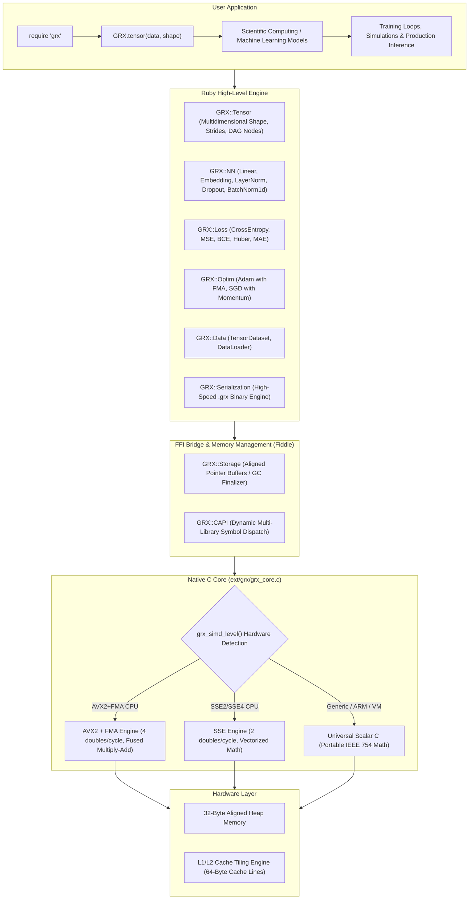
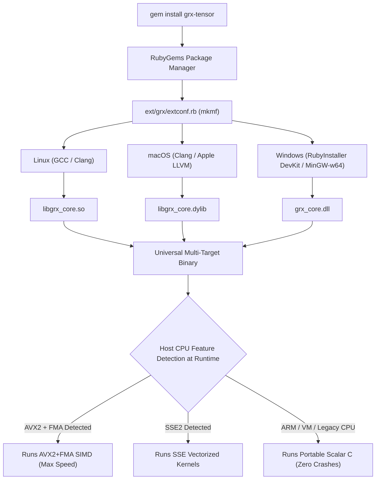
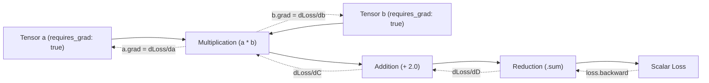

# GRX-Tensor

**Ruby speaks. C computes.**

A high-performance scientific computing, multidimensional tensor, and deep learning framework for Ruby. Features automatic differentiation (Autograd), dynamic multi-target SIMD hardware acceleration (AVX2+FMA, SSE, and portable scalar C), and complete neural network primitives behind a clean, expressive Ruby API.

[](https://www.ruby-lang.org)
[](LICENSE.txt)
[](https://github.com/Gabo-Razo/grx-tensor)

---

## Architectural Flow



---

## Universal Build & Dynamic Hardware Dispatch



---

## Table of Contents

1. [Key Features](#key-features)
2. [Installation](#installation)
3. [Beginner-Friendly Quickstart Tutorials](#beginner-friendly-quickstart-tutorials)
   - [1. Celsius to Fahrenheit Converter](#1-celsius-to-fahrenheit-converter-1-neuron-learns-f--18c--32)
   - [2. Logic Gates (AND & XOR)](#2-logic-gates-and-linear-vs-non-linear-xor-with-relu--sigmoid)
   - [3. Everyday Tensor Math](#3-everyday-tensor-math-in-4-lines)
4. [Tensor API Reference & Core Operations](#tensor-api-reference--core-operations)
5. [Autograd & Gradient Engine](#autograd--gradient-engine)
6. [Scientific & Numerical Computing (Beyond Deep Learning)](#scientific--numerical-computing-beyond-deep-learning)
   - [A. Computer Vision & Image Filtering (Sobel Kernel Convolution)](#a-computer-vision--image-filtering-sobel-kernel-convolution)
   - [B. Quantitative Finance & Portfolio Covariance](#b-quantitative-finance--portfolio-covariance)
   - [C. Particle Physics & N-Body Simulation](#c-particle-physics--n-body-simulation)
   - [D. Pure Mathematical Optimization with Autograd (Rosenbrock Function)](#d-pure-mathematical-optimization-with-autograd-rosenbrock-function)
7. [Deep Learning Cookbook (10 Neural Network Architectures)](#deep-learning-cookbook-10-neural-network-architectures)
   - [Architecture 1: Deep Vision & Character Classifier (BatchNorm + Dropout)](#architecture-1-deep-vision--character-classifier-batchnorm--dropout)
   - [Architecture 2: NLP & Intent Chatbot (Embedding + LayerNorm)](#architecture-2-nlp--intent-chatbot-embedding--layernorm)
   - [Architecture 3: Reinforcement Learning (Deep Q-Network Agent)](#architecture-3-reinforcement-learning-deep-q-network-agent)
   - [Architecture 4: Nonlinear Multi-Variable Time Series Forecasting](#architecture-4-nonlinear-multi-variable-time-series-forecasting)
   - [Architecture 5: Deep Autoencoder for Dimensionality Reduction & Anomaly Detection](#architecture-5-deep-autoencoder-for-dimensionality-reduction--anomaly-detection)
   - [Architecture 6: Autoregressive Next-Token Character Language Model & Generator](#architecture-6-autoregressive-next-token-character-language-model--generator)
   - [Architecture 7: Sentiment Analysis & Review Classification (BCELoss)](#architecture-7-sentiment-analysis--review-classification-bceloss)
   - [Architecture 8: Siamese Neural Network for Similarity & Verification](#architecture-8-siamese-neural-network-for-similarity--verification)
   - [Architecture 9: Deep Residual Network (ResNet MLP Block with Skip Connection)](#architecture-9-deep-residual-network-resnet-mlp-block-with-skip-connection)
   - [Architecture 10: Neural Collaborative Filtering & Recommendation System](#architecture-10-neural-collaborative-filtering--recommendation-system)
8. [Loss Functions (GRX::Loss)](#loss-functions-grxloss)
9. [Scientific Notation & Hyperparameter Reference](#scientific-notation--hyperparameter-reference)
   - [1. Scientific Notation in Machine Learning (1e-1 to 1e-8)](#1-scientific-notation-in-machine-learning-1e-1-to-1e-8)
   - [2. Neural Layer Parameters (GRX::NN)](#2-neural-layer-parameters-grxnn)
10. [Optimizers & Hyperparameter Reference (GRX::Optim)](#optimizers--hyperparameter-reference-grxoptim)
11. [Data Pipelines & DataLoader (GRX::Data)](#data-pipelines--dataloader-grxdata)
12. [Model Persistence & Brain Serialization (.grx Format)](#model-persistence--brain-serialization-grx-format)
    - [Binary Format Layout (GRX1 Specification)](#binary-format-layout-grx1-specification)
    - [Production Inference Deployment Workflow](#production-inference-deployment-workflow)
13. [Gradient Management & Utilities (GRX::Utils)](#gradient-management--utilities-grxutils)
14. [Windows Support & Toolchain Guide](#windows-support--toolchain-guide)
15. [License](#license)

---

## Key Features

| Feature | Specification |
|---|---|
| **Multi-Target SIMD Engine** | Dynamic runtime CPU detection routes ops to AVX2+FMA, SSE, or portable scalar C |
| **Aligned Heap Memory** | 32-byte aligned native heap buffers (`posix_memalign` / `_aligned_malloc`) |
| **Zero-Copy Views** | Strided geometric transformations (`reshape`, `transpose`, `flatten`, `t`) |
| **Autograd Engine** | Reverse-mode automatic differentiation with dynamic DAG backpropagation |
| **Neural Layers** | `Linear`, `Sequential`, `Embedding`, `LayerNorm`, `BatchNorm1d`, `Dropout` |
| **Activation Functions** | `ReLU`, `LeakyReLU`, `Sigmoid`, `Tanh`, `Softmax` (fully differentiable) |
| **Loss Functions** | `MSELoss`, `MAELoss`, `BCELoss`, `CrossEntropyLoss`, `HuberLoss` |
| **Optimizers** | `Adam` (with FMA acceleration and bias correction), `SGD` (with momentum and weight decay) |
| **Binary Persistence** | Fast `.grx` binary serialization format for instant weight saving and loading |
| **Data Pipelines** | `TensorDataset` and `DataLoader` with batching, slicing, and shuffling |
| **Weight Initializers** | Xavier uniform and He normal (xorshift64* and Box-Muller in C) |
| **Cross-Platform** | Linux (`.so`), macOS (`.dylib`), Windows (`.dll` via DevKit) |
| **Pure Ruby Fallback** | Runs seamlessly in pure Ruby mode when native compiler tools are unavailable |

---

---

## Installation

### Standard RubyGems Installation

```bash
gem install grx-tensor
```

Or add it to your project's `Gemfile`:

```ruby
gem "grx-tensor"
```

The native C extension is automatically compiled and linked in the background during installation.

---

## Beginner-Friendly Quickstart Tutorials

### 1. Celsius to Fahrenheit Converter (1 Neuron Learns $F = 1.8C + 32$)

The absolute "Hello World" of Machine Learning. A single linear neuron ($y = w \cdot x + b$) discovers the physical laws of temperature on its own:

```ruby
require "grx"

# 1. Training data (Celsius and Fahrenheit pairs)
celsius    = GRX.tensor([18.0, 25.0, 14.0, 21.0,  9.0, 16.0,  4.0, 32.0], [8, 1])
fahrenheit = GRX.tensor([64.4, 77.0, 57.2, 69.8, 48.2, 60.8, 39.2, 89.6], [8, 1])

# 2. Build 1-neuron model
model = GRX::NN::Sequential.new(GRX::NN::Linear.new(1, 1))
optimizer = GRX::Optim::Adam.new(model.parameters, lr: 0.8)
loss_fn = GRX::Loss::MSELoss.new

# 3. Train in 5 lines
1500.times do
  optimizer.zero_grad
  prediction = model.call(celsius)
  loss = loss_fn.call(prediction, fahrenheit)
  loss.backward
  optimizer.step
end

# 4. Predict unseen temperatures
test_temps = GRX.tensor([[100.0], [0.0], [37.0]], [3, 1])
predictions = model.call(test_temps).to_a

puts "100.0 C -> #{predictions[0].round(1)} F (Expected: 212.0 F)"
puts "  0.0 C -> #{predictions[1].round(1)} F (Expected:  32.0 F)"
puts " 37.0 C -> #{predictions[2].round(1)} F (Expected:  98.6 F)"
```

---

### 2. Logic Gates (AND Linear vs Non-Linear XOR with ReLU & Sigmoid)

Solving the classic non-linear XOR problem using a 2-layer neural network:

```ruby
require "grx"

# XOR Truth Table: (0,0)->0, (0,1)->1, (1,0)->1, (1,1)->0
x = GRX.tensor([[0.0, 0.0], [0.0, 1.0], [1.0, 0.0], [1.0, 1.0]], [4, 2])
y = GRX.tensor([[0.0], [1.0], [1.0], [0.0]], [4, 1])

# Multi-layer network: 2 inputs -> 4 hidden (ReLU) -> 1 output (Sigmoid)
xor_net = GRX::NN::Sequential.new(
  GRX::NN::Linear.new(2, 4),
  GRX::NN::ReLU.new,
  GRX::NN::Linear.new(4, 1),
  GRX::NN::Sigmoid.new
)

opt = GRX::Optim::Adam.new(xor_net.parameters, lr: 0.05)
loss_fn = GRX::Loss::BCELoss.new

400.times do
  opt.zero_grad
  pred = xor_net.call(x)
  loss = loss_fn.call(pred, y)
  loss.backward
  opt.step
end

puts "XOR Predictions: #{xor_net.call(x).to_a.map { |v| v.round(3) }}"
```

---

### 3. Everyday Tensor Math in 4 Lines

```ruby
require "grx"

prices = GRX.tensor([19.99, 45.50, 120.00, 5.25], [4])
discounted = (prices * 0.85).round(2) rescue (prices * 0.85) # 15% discount applied

puts "Total revenue: #{prices.sum.item.round(2)}"
puts "Average price: #{prices.mean.item.round(2)}"
puts "Most expensive item index: #{prices.argmax}"
```

---

## Tensor API Reference & Core Operations

Tensors in GRX represent multidimensional arrays of 64-bit IEEE 754 floating-point numbers stored in contiguous native memory buffers.

### 1. Creation & Factory Methods

```ruby
require "grx"

# 1. From flat or nested Ruby arrays (integers and floats)
t1 = GRX.tensor([1.0, 2.0, 3.0, 4.0], [2, 2])
t2 = GRX.tensor([[1.0, 2.0], [3.0, 4.0]], [2, 2], requires_grad: true)

# 2. Zeros and Ones
zeros = GRX.zeros([3, 4])
ones  = GRX.ones([2, 5], requires_grad: true)

# 3. Random initialization
uniform_rand = GRX.rand([4, 4])          # Uniform distribution U[0, 1)
normal_rand  = GRX.randn([4, 4])         # Standard normal distribution N(0, 1)

# 4. Weight initialization factories
xavier = GRX::Tensor.xavier_uniform([64, 32], requires_grad: true)
he     = GRX::Tensor.he_normal([64, 32], requires_grad: true)

# 5. Like factories
z_like = GRX::Tensor.zeros_like(t1)
o_like = GRX::Tensor.ones_like(t1)
```

### 2. Inspection & Element Access

```ruby
t = GRX.tensor([1.0, 2.0, 3.0, 4.0, 5.0, 6.0], [2, 3])

puts t.shape          # [2, 3] (Dimensions)
puts t.strides        # [3, 1] (Memory strides)
puts t.numel          # 6 (Total elements count)
puts t.rank           # 2 (Number of dimensions)
puts t.item           # Returns scalar float if numel == 1
puts t.to_a           # [1.0, 2.0, 3.0, 4.0, 5.0, 6.0]
puts t.get(1, 2)      # 6.0 (Element at row 1, col 2)
t.set(1, 2, 9.9)      # Updates element at (1, 2)
```

### 3. Arithmetic Operations (SIMD Accelerated)

```ruby
a = GRX.tensor([1.0, 2.0, 3.0], [3])
b = GRX.tensor([4.0, 5.0, 6.0], [3])

c_add = a + b         # [5.0, 7.0, 9.0]
c_sub = a - b         # [-3.0, -3.0, -3.0]
c_mul = a * b         # [4.0, 10.0, 18.0]
c_div = b / a         # [4.0, 2.5, 2.0]
c_neg = -a            # [-1.0, -2.0, -3.0]

# Scalar operations
s_add = a + 10.0      # [11.0, 12.0, 13.0]
s_mul = a * 2.0       # [2.0, 4.0, 6.0]
s_div = a / 2.0       # [0.5, 1.0, 1.5]
```

### 4. Element-Wise Math Functions

```ruby
t = GRX.tensor([1.0, 4.0, 9.0, 16.0], [4])

puts t.sqrt.to_a       # [1.0, 2.0, 3.0, 4.0]
puts t.square.to_a     # [1.0, 16.0, 81.0, 256.0]
puts t.abs.to_a        # [1.0, 4.0, 9.0, 16.0]
puts t.pow(3.0).to_a   # [1.0, 64.0, 729.0, 4096.0]
puts t.log.to_a        # Natural logarithm ln(x)
puts t.exp.to_a        # Exponential e^x
puts t.clip(2.0, 10.0) # Clamps values to [2.0, 10.0]
```

### 5. Matrix Multiplication & Linear Algebra

```ruby
# Matrix multiplication (Cache Tiling SIMD)
m1 = GRX.tensor([1.0, 2.0, 3.0, 4.0, 5.0, 6.0], [2, 3])
m2 = GRX.tensor([7.0, 8.0, 9.0, 10.0, 11.0, 12.0], [3, 2])

result = m1 @ m2       # Equivalent to m1.matmul(m2), returns Shape [2, 2]

# Dot product (1D vectors)
v1 = GRX.tensor([1.0, 2.0, 3.0], [3])
v2 = GRX.tensor([4.0, 5.0, 6.0], [3])
dot_val = v1.dot(v2)   # 32.0 (Double precision scalar)
```

### 6. Geometric Transformations (Zero-Copy Views)

```ruby
matrix = GRX.tensor([1.0, 2.0, 3.0, 4.0, 5.0, 6.0], [2, 3])

# Reshape & Flatten
reshaped = matrix.reshape([3, 2])  # Shape [3, 2]
flat     = matrix.flatten          # Shape [6]

# Transpose
transposed = matrix.transpose(0, 1) # Shape [3, 2]
t_view     = matrix.t               # Shorthand 2D transpose
```

### 7. Reductions & Statistics

```ruby
t = GRX.tensor([2.0, 4.0, 6.0, 8.0], [4], requires_grad: true)

s = t.sum             # Scalar tensor [20.0], autograd node
m = t.mean            # Scalar tensor [5.0], autograd node
max_val = t.max       # 8.0 (Scalar float)
min_val = t.min       # 2.0 (Scalar float)
best_idx = t.argmax   # 3 (Index of maximum value)
worst_idx = t.argmin  # 0 (Index of minimum value)
```

---

## Autograd & Gradient Engine

GRX features a dynamic Directed Acyclic Graph (DAG) reverse-mode automatic differentiation engine. Calling `backward` propagates derivatives according to the chain rule.



```ruby
require "grx"

x = GRX.tensor([2.0, 3.0], [2], requires_grad: true)
w = GRX.tensor([4.0, 5.0], [2], requires_grad: true)
b = GRX.tensor([1.0, 1.0], [2], requires_grad: true)

y = (x * w) + b
loss = y.sum
loss.backward

puts "x.grad: #{x.grad.to_a}"  # [4.0, 5.0]
puts "w.grad: #{w.grad.to_a}"  # [2.0, 3.0]
puts "b.grad: #{b.grad.to_a}"  # [1.0, 1.0]
```

---

## Scientific & Numerical Computing (Beyond Deep Learning)

Tensors are general-purpose multidimensional mathematical engines suitable for image processing, numerical physics, quantitative finance, and pure mathematical optimization.

### A. Computer Vision & Image Filtering (Sobel Kernel Convolution)

Apply spatial filtering and edge detection directly on 2D image pixel grids:

```ruby
require "grx"

# 1. Create a 6x6 grayscale synthetic image tensor
image = GRX.tensor([
  0.0,   0.0,   0.0, 255.0, 255.0, 255.0,
  0.0,   0.0,   0.0, 255.0, 255.0, 255.0,
  0.0,   0.0,   0.0, 255.0, 255.0, 255.0,
  0.0,   0.0,   0.0, 255.0, 255.0, 255.0,
  0.0,   0.0,   0.0, 255.0, 255.0, 255.0,
  0.0,   0.0,   0.0, 255.0, 255.0, 255.0
], [6, 6])

# 2. Define horizontal Sobel edge detection kernel (3x3)
sobel_h = GRX.tensor([
  -1.0, 0.0, 1.0,
  -2.0, 0.0, 2.0,
  -1.0, 0.0, 1.0
], [3, 3])

# 3. 2D Spatial Convolution
out_rows = image.shape[0] - sobel_h.shape[0] + 1
out_cols = image.shape[1] - sobel_h.shape[1] + 1
edge_map_data = []

out_rows.times do |r|
  out_cols.times do |c|
    patch_values = []
    3.times do |kr|
      3.times do |kc|
        patch_values << image.get(r + kr, c + kc)
      end
    end
    patch_tensor = GRX.tensor(patch_values, [3, 3])
    conv_val = (patch_tensor * sobel_h).sum.item
    edge_map_data << conv_val.abs
  end
end

edge_map = GRX.tensor(edge_map_data, [out_rows, out_cols])
puts "Detected Edges Shape: #{edge_map.shape}"
```

---

### B. Quantitative Finance & Portfolio Covariance

Calculate asset returns, annualized volatility, and portfolio risk matrix:

```ruby
require "grx"

prices = GRX.tensor([
  100.0,  50.0,  200.0,
  102.0,  49.0,  205.0,
  101.0,  51.0,  210.0,
  105.0,  52.0,  208.0,
  108.0,  53.0,  215.0
], [5, 3])

# 1. Compute Daily Simple Returns: (P_t - P_{t-1}) / P_{t-1}
returns_data = []
4.times do |t|
  3.times do |asset|
    p_prev = prices.get(t, asset)
    p_curr = prices.get(t + 1, asset)
    returns_data << ((p_curr - p_prev) / p_prev)
  end
end
returns = GRX.tensor(returns_data, [4, 3])

# 2. Mean centering
mean_returns = Array.new(3) do |asset|
  asset_col = 4.times.map { |d| returns.get(d, asset) }
  asset_col.sum / 4.0
end

centered_data = []
4.times do |d|
  3.times do |asset|
    centered_data << (returns.get(d, asset) - mean_returns[asset])
  end
end
centered_returns = GRX.tensor(centered_data, [4, 3])

# 3. Covariance Matrix: Sigma = (X^T @ X) / (N - 1)
cov_matrix = (centered_returns.t @ centered_returns) / 3.0

# 4. Portfolio Variance for weights w = [0.4, 0.3, 0.3]
weights = GRX.tensor([[0.4, 0.3, 0.3]], [1, 3])
port_variance = (weights @ cov_matrix @ weights.t).item
port_volatility = Math.sqrt(port_variance)

puts "Portfolio Daily Volatility: #{(port_volatility * 100).round(4)}%"
```

---

### C. Particle Physics & N-Body Simulation

Simulate particle positions, velocities, and pairwise Euclidean distances in 3D:

```ruby
require "grx"

n_particles = 4
dt = 0.01

positions = GRX.tensor([
  0.0, 0.0, 0.0,
  1.0, 0.0, 0.0,
  0.0, 1.0, 0.0,
  0.0, 0.0, 1.0
], [n_particles, 3])

velocities = GRX.tensor([
  0.1, 0.0, 0.0,
  0.0, 0.2, 0.0,
  0.0, 0.0, 0.1,
 -0.1, 0.0, 0.0
], [n_particles, 3])

gravity = GRX.tensor(Array.new(n_particles * 3) { |i| (i % 3 == 1) ? -9.81 : 0.0 }, [n_particles, 3])

velocities = velocities + (gravity * dt)
positions  = positions  + (velocities * dt)

dist_matrix_data = []
n_particles.times do |i|
  n_particles.times do |j|
    dx = positions.get(i, 0) - positions.get(j, 0)
    dy = positions.get(i, 1) - positions.get(j, 1)
    dz = positions.get(i, 2) - positions.get(j, 2)
    dist_matrix_data << Math.sqrt(dx*dx + dy*dy + dz*dz)
  end
end

dist_matrix = GRX.tensor(dist_matrix_data, [n_particles, n_particles])
puts "Pairwise Distances (P0 to P1): #{dist_matrix.get(0, 1).round(4)}"
```

---

### D. Pure Mathematical Optimization with Autograd (Rosenbrock Function)

Find the global minimum of the non-convex Rosenbrock Banana Function:
$$f(x, y) = (a - x)^2 + b(y - x^2)^2 \quad \text{with } a=1, b=100$$

```ruby
require "grx"

point = GRX.tensor([-1.5, 2.0], [2], requires_grad: true)
lr = 0.002

500.times do |step|
  x = point.get(0)
  y = point.get(1)

  tx = GRX.tensor([x], [1], requires_grad: true)
  ty = GRX.tensor([y], [1], requires_grad: true)

  term1 = (GRX.tensor([1.0], [1]) - tx).square
  term2 = (ty - tx.square).square * 100.0
  loss = term1 + term2
  loss.backward

  new_x = x - lr * tx.grad.item
  new_y = y - lr * ty.grad.item
  point = GRX.tensor([new_x, new_y], [2])
end

puts "Converged Minimum: x = #{point.get(0).round(3)}, y = #{point.get(1).round(3)}"
```

---

## Deep Learning Cookbook (10 Neural Network Architectures)

### Architecture 1: Deep Vision & Character Classifier (BatchNorm + Dropout)

```ruby
require "grx"

vision_net = GRX::NN::Sequential.new(
  GRX::NN::Linear.new(784, 256),
  GRX::NN::BatchNorm1d.new(256),
  GRX::NN::ReLU.new,
  GRX::NN::Dropout.new(0.25),
  GRX::NN::Linear.new(256, 64),
  GRX::NN::LayerNorm.new(64),
  GRX::NN::LeakyReLU.new(alpha: 0.01),
  GRX::NN::Linear.new(64, 10),
  GRX::NN::Softmax.new
)

batch_images = GRX.randn([16, 784])
predictions  = vision_net.forward(batch_images) # Shape [16, 10]
puts "Vision Predictions Shape: #{predictions.shape}"
```

---

### Architecture 2: NLP & Intent Chatbot (Embedding + LayerNorm)

```ruby
require "grx"

vocab_size    = 500
embedding_dim = 32
num_classes   = 4

embedding  = GRX::NN::Embedding.new(vocab_size, embedding_dim)
classifier = GRX::NN::Sequential.new(
  GRX::NN::LayerNorm.new(embedding_dim),
  GRX::NN::Linear.new(embedding_dim, 16),
  GRX::NN::Tanh.new,
  GRX::NN::Linear.new(16, num_classes)
)

token_ids = GRX.tensor([14, 2, 88, 412], [4])
dense_words = embedding.forward(token_ids)

seq_mean = Array.new(embedding_dim) do |d|
  4.times.sum { |t| dense_words.get(t, d) } / 4.0
end
sentence_vector = GRX.tensor(seq_mean, [1, embedding_dim])

logits = classifier.forward(sentence_vector)
puts "Predicted Intent Class: #{logits.argmax}"
```

---

### Architecture 3: Reinforcement Learning (Deep Q-Network Agent)

```ruby
require "grx"

state_dim  = 8
action_dim = 4

q_net = GRX::NN::Sequential.new(
  GRX::NN::Linear.new(state_dim, 64),
  GRX::NN::ReLU.new,
  GRX::NN::Linear.new(64, 64),
  GRX::NN::ReLU.new,
  GRX::NN::Linear.new(64, action_dim)
)

optimizer = GRX::Optim::Adam.new(q_net.parameters, lr: 0.001)
huber_loss = GRX::Loss::HuberLoss.new(delta: 1.0)

current_state = GRX.randn([1, state_dim])
target_q_vals = GRX.tensor([[1.2, 0.5, -0.8, 3.4]], [1, 4])

optimizer.zero_grad
predicted_q_vals = q_net.forward(current_state)
loss = huber_loss.call(predicted_q_vals, target_q_vals)
loss.backward
optimizer.step

puts "Q-Loss: #{loss.item.round(6)}"
```

---

### Architecture 4: Nonlinear Multi-Variable Time Series Forecasting

```ruby
require "grx"

forecaster = GRX::NN::Sequential.new(
  GRX::NN::Linear.new(5, 32),
  GRX::NN::Sigmoid.new,
  GRX::NN::Linear.new(32, 16),
  GRX::NN::ReLU.new,
  GRX::NN::Linear.new(16, 1)
)

optimizer = GRX::Optim::Adam.new(forecaster.parameters, lr: 0.01, weight_decay: 1e-4)
criterion = GRX::Loss::MSELoss.new

sensor_input = GRX.tensor([[22.5, 60.1, 1013.2, 5.4, 0.8]], [1, 5])
expected_temp = GRX.tensor([[23.1]], [1, 1])

optimizer.zero_grad
pred = forecaster.forward(sensor_input)
loss = criterion.call(pred, expected_temp)
loss.backward
optimizer.step

puts "Forecast Error: #{loss.item.round(6)}"
```

---

### Architecture 5: Deep Autoencoder for Dimensionality Reduction & Anomaly Detection

Compresses high-dimensional feature vectors into a compressed latent bottleneck and reconstructs them:

```ruby
require "grx"

# 1. Encoder network: 64 inputs -> 16 hidden -> 4 latent code
encoder = GRX::NN::Sequential.new(
  GRX::NN::Linear.new(64, 16),
  GRX::NN::LayerNorm.new(16),
  GRX::NN::ReLU.new,
  GRX::NN::Linear.new(16, 4)
)

# 2. Decoder network: 4 latent code -> 16 hidden -> 64 reconstructed outputs
decoder = GRX::NN::Sequential.new(
  GRX::NN::Linear.new(4, 16),
  GRX::NN::LayerNorm.new(16),
  GRX::NN::ReLU.new,
  GRX::NN::Linear.new(16, 64),
  GRX::NN::Sigmoid.new
)

optimizer = GRX::Optim::Adam.new(encoder.parameters + decoder.parameters, lr: 0.01)
recon_loss_fn = GRX::Loss::MSELoss.new

# Training reconstruction loop
sample_batch = GRX.rand([8, 64])

optimizer.zero_grad
latent_code = encoder.forward(sample_batch)      # Shape [8, 4]
reconstruction = decoder.forward(latent_code)    # Shape [8, 64]
loss = recon_loss_fn.call(reconstruction, sample_batch)
loss.backward
optimizer.step

puts "Autoencoder Reconstruction Loss: #{loss.item.round(6)}"
```

---

### Architecture 6: Autoregressive Next-Token Character Language Model & Generator

Generates text character-by-character using embedding lookups and dense prediction heads:

```ruby
require "grx"

vocab_size = 256 # ASCII alphabet
embed_dim  = 16
ctx_len    = 4   # 4-character context window

char_embedding = GRX::NN::Embedding.new(vocab_size, embed_dim)
language_head  = GRX::NN::Sequential.new(
  GRX::NN::Linear.new(embed_dim * ctx_len, 64),
  GRX::NN::LayerNorm.new(64),
  GRX::NN::Tanh.new,
  GRX::NN::Linear.new(64, vocab_size)
)

# Predict next character for context "hell" -> tokens [104, 101, 108, 108]
context_ids = GRX.tensor([104, 101, 108, 108], [4])
embedded = char_embedding.forward(context_ids) # Shape [4, 16]
flattened_context = embedded.flatten.reshape([1, embed_dim * ctx_len])

logits = language_head.forward(flattened_context) # Shape [1, 256]
predicted_char_ascii = logits.argmax

puts "Context: 'hell' -> Predicted Next Char: '#{predicted_char_ascii.chr}' (ASCII #{predicted_char_ascii})"
```

---

### Architecture 7: Sentiment Analysis & Review Classification (BCELoss)

Evaluates text sentiment polarity (Positive / Negative) from word token streams:

```ruby
require "grx"

vocab_size = 1000
embed_dim  = 32

sentiment_embedding = GRX::NN::Embedding.new(vocab_size, embed_dim)
sentiment_head = GRX::NN::Sequential.new(
  GRX::NN::LayerNorm.new(embed_dim),
  GRX::NN::Linear.new(embed_dim, 16),
  GRX::NN::ReLU.new,
  GRX::NN::Dropout.new(0.2),
  GRX::NN::Linear.new(16, 1),
  GRX::NN::Sigmoid.new
)

# Review token stream: "excellent quality product fast delivery" -> [42, 189, 7, 85, 301]
review_tokens = GRX.tensor([42, 189, 7, 85, 301], [5])
vectors = sentiment_embedding.forward(review_tokens) # Shape [5, 32]

# Global average pooling across words
review_representation = Array.new(embed_dim) do |d|
  5.times.sum { |t| vectors.get(t, d) } / 5.0
end
review_tensor = GRX.tensor(review_representation, [1, embed_dim])

polarity_prob = sentiment_head.forward(review_tensor).item
sentiment_label = polarity_prob >= 0.5 ? "POSITIVE" : "NEGATIVE"

puts "Sentiment Score: #{(polarity_prob * 100).round(2)}% -> #{sentiment_label}"
```

---

### Architecture 8: Siamese Neural Network for Similarity & Verification

Twin branches sharing weights for signature, face, or document similarity verification:

```ruby
require "grx"

# Shared feature extractor
feature_extractor = GRX::NN::Sequential.new(
  GRX::NN::Linear.new(32, 16),
  GRX::NN::LayerNorm.new(16),
  GRX::NN::Tanh.new,
  GRX::NN::Linear.new(16, 8)
)

# Two sample inputs (e.g. Signature A and Signature B)
sig_a = GRX.randn([1, 32])
sig_b = GRX.randn([1, 32])

# Compute dense embedding vectors using identical shared weights
embedding_a = feature_extractor.forward(sig_a) # Shape [1, 8]
embedding_b = feature_extractor.forward(sig_b) # Shape [1, 8]

# Compute Euclidean embedding distance
diff = embedding_a - embedding_b
distance = diff.square.sum.sqrt.item

match = distance < 1.0 ? "MATCH (Same Entity)" : "NO MATCH (Different Entities)"
puts "Embedding Distance: #{distance.round(4)} -> #{match}"
```

---

### Architecture 9: Deep Residual Network (ResNet MLP Block with Skip Connection)

Enables training deep networks without gradient degradation using identity shortcut connections $y = x + F(x)$:

```ruby
require "grx"

class ResidualBlock < GRX::NN::Module
  def initialize(dim)
    @fc1 = GRX::NN::Linear.new(dim, dim)
    @bn1 = GRX::NN::BatchNorm1d.new(dim)
    @act = GRX::NN::ReLU.new
    @fc2 = GRX::NN::Linear.new(dim, dim)
    @bn2 = GRX::NN::BatchNorm1d.new(dim)
  end

  def forward(x)
    residual = x
    out = @fc1.forward(x)
    out = @bn1.forward(out)
    out = @act.forward(out)
    out = @fc2.forward(out)
    out = @bn2.forward(out)
    out + residual # Identity Skip Connection
  end
end

res_block = ResidualBlock.new(16)
x_in = GRX.randn([4, 16])
res_out = res_block.forward(x_in)

puts "Residual Block Output Shape: #{res_out.shape}"
```

---

### Architecture 10: Neural Collaborative Filtering & Recommendation System

Combines User and Item latent embeddings with interaction MLP layers to predict recommendation scores:

```ruby
require "grx"

n_users = 100
n_items = 50
latent_dim = 16

user_embedding = GRX::NN::Embedding.new(n_users, latent_dim)
item_embedding = GRX::NN::Embedding.new(n_items, latent_dim)

rating_mlp = GRX::NN::Sequential.new(
  GRX::NN::Linear.new(latent_dim * 2, 16),
  GRX::NN::ReLU.new,
  GRX::NN::Linear.new(16, 1),
  GRX::NN::Sigmoid.new
)

# Predict recommendation score for User #7 and Movie #23
u_idx = GRX.tensor([7], [1])
i_idx = GRX.tensor([23], [1])

u_vec = user_embedding.forward(u_idx) # Shape [1, 16]
i_vec = item_embedding.forward(i_idx) # Shape [1, 16]

# Concatenate user and item embeddings -> Shape [1, 32]
interaction_vector = GRX.tensor(u_vec.to_a + i_vec.to_a, [1, latent_dim * 2])
predicted_rating = rating_mlp.forward(interaction_vector).item

puts "Predicted Affinity Score: #{(predicted_rating * 5.0).round(2)} / 5.0 Stars"
```

---

## Loss Functions (`GRX::Loss`)

All loss functions return a differentiable `GRX::Tensor` ready for `loss.backward`.

| Loss Class | Constructor Signature & Parameters | Default | Mathematical Use Case & Description |
|---|---|---|---|
| `GRX::Loss::MSELoss` | `new(reduction: :mean)` | `reduction: :mean` | Mean Squared Error: $\frac{1}{N}\sum(y_{pred} - y_{true})^2$. Standard for continuous regression. |
| `GRX::Loss::MAELoss` | `new(reduction: :mean)` | `reduction: :mean` | Mean Absolute Error: $\frac{1}{N}\sum \|y_{pred} - y_{true}\|$. Robust to large outliers. |
| `GRX::Loss::BCELoss` | `new(reduction: :mean, eps: 1e-7)` | `eps: 1e-7` | Binary Cross Entropy: $-[y \log(p) + (1-y) \log(1-p)]$. Clamped by `eps` to prevent $\log(0)$. |
| `GRX::Loss::CrossEntropyLoss` | `new(reduction: :mean)` | `reduction: :mean` | Multi-Class Cross Entropy. Combines Log-Sum-Exp softmax with negative log-likelihood. |
| `GRX::Loss::HuberLoss` | `new(delta: 1.0, reduction: :mean)` | `delta: 1.0` | Smooth L1 / Huber: Quadratic for error $< \delta$, linear for error $\ge \delta$. Outlier resistant. |

* `reduction` options: `:mean` (divides total loss by mini-batch size; recommended) or `:sum` (accumulates unscaled sum).

---

## Scientific Notation & Hyperparameter Reference

### 1. Scientific Notation in Machine Learning (`1e-1` to `1e-8`)

Deep learning parameters often represent fractional quantities (learning rates, regularization terms, variance stabilizers). GRTensor fully supports standard Ruby scientific notation literals:

| Notation | Exact Decimal | Fraction | Common Name | Typical Use Case in GRTensor |
|---|---|---|---|---|
| `1e-1` | `0.1` | $1/10$ | One Tenth | Fast learning rate in simple models, `BatchNorm1d` momentum. |
| `1e-2` | `0.01` | $1/100$ | One Hundredth | Default `SGD` learning rate, `LeakyReLU` negative slope (`alpha`). |
| `1e-3` | `0.001` | $1/1,000$ | One Thousandth | Gold standard default learning rate (`lr`) for `Adam` optimizer. |
| `1e-4` | `0.0001` | $1/10,000$ | One Ten-Thousandth | Recommended L2 regularization penalty (`weight_decay`) to prevent overfitting. |
| `1e-5` | `0.00001` | $1/100,000$ | One Hundred-Thousandth | Variance stabilizer constant (`eps`) in `LayerNorm` and `BatchNorm1d`. |
| `1e-7` | `0.0000001` | $1/10,000,000$ | One Ten-Millionth | Numerical safety clamp (`eps`) in `BCELoss` preventing $\log(0) \to -\infty$. |
| `1e-8` | `0.00000001` | $1/100,000,000$ | One Hundred-Millionth | Denominator variance stabilizer (`eps`) in `Adam` optimizer. |

---

### 2. Neural Layer Parameters (`GRX::NN`)

| Layer Class | Parameter | Type | Default | Valid Range | Physical & Computational Meaning |
|---|---|---|---|---|---|
| `Linear` | `in_features` | Integer | (Required) | $\ge 1$ | Dimensionality of input feature vectors. |
| `Linear` | `out_features`| Integer | (Required) | $\ge 1$ | Number of neurons / output features produced. |
| `Linear` | `bias` | Boolean | `true` | `true` / `false` | When `true`, adds trainable bias vector $b$ ($y = Wx + b$). |
| `Embedding` | `num_embeddings`| Integer | (Required) | $\ge 1$ | Total vocabulary size or entity count. |
| `Embedding` | `embedding_dim` | Integer | (Required) | $\ge 1$ | Dimensionality of dense latent vector for each token. |
| `Dropout` | `p` | Float | `0.5` | `0.0` to `0.99` | Probability of zeroing out activations during training to prevent co-adaptation. |
| `LeakyReLU` | `alpha` | Float | `0.01` | `0.001` to `0.3` | Slope for negative inputs ($x < 0$). Prevents dead neurons. |
| `LayerNorm` | `normalized_shape` | Int/Array | (Required) | Dimensions | Feature dimensions over which mean and variance are normalized. |
| `LayerNorm` | `eps` / `epsilon` | Float | `1e-5` | `1e-8` to `1e-4` | Variance stabilizer added to denominator. |
| `BatchNorm1d` | `num_features` | Integer | (Required) | $\ge 1$ | Number of channels normalized across the mini-batch dimension. |
| `BatchNorm1d` | `eps` / `epsilon` | Float | `1e-5` | `1e-8` to `1e-4` | Variance stabilizer added to denominator. |
| `BatchNorm1d` | `momentum` | Float | `0.1` | `0.01` to `0.5` | Exponential moving average factor for running mean and variance. |

### 3. Tensor Creation & Core Operations Parameters (`GRX::Tensor`)

| Factory / Method | Parameter | Type | Default | Description |
|---|---|---|---|---|
| `GRX.tensor` | `data` | Array / Storage | (Required) | Flat or nested Ruby numbers array (`[1.0, 2.0]` or `[[1, 2], [3, 4]]`). |
| `GRX.tensor` | `shape` | Array[Integer] | `nil` (Auto) | Explicit dimensions (e.g. `[2, 3]`). Auto-inferred if omitted. |
| `GRX.tensor` | `requires_grad`| Boolean | `false` | Enables reverse-mode autograd tracking in the computational DAG. |
| `GRX.zeros` / `GRX.ones` | `shape` | Array[Integer] | (Required) | Shape dimensions initialized to `0.0` or `1.0`. |
| `GRX.rand` | `shape` | Array[Integer] | (Required) | Uniformly distributed random tensor $U[0, 1)$. |
| `GRX.randn` | `shape` | Array[Integer] | (Required) | Standard normal random tensor $N(0, 1)$ via Box-Muller transformation. |
| `Tensor.xavier_uniform`| `shape` | Array[Integer] | (Required) | Xavier/Glorot uniform initialization ($U[-\sqrt{6/(f_{in}+f_{out})}, \sqrt{6/(f_{in}+f_{out})}]$). |
| `Tensor.he_normal` | `shape` | Array[Integer] | (Required) | He/Kaiming normal initialization ($N(0, \sqrt{2/f_{in}})$). Optimal for ReLU. |
| `Tensor.zeros_like` | `other` | Tensor | (Required) | Creates zeros tensor matching `other.shape`. |
| `Tensor.ones_like` | `other` | Tensor | (Required) | Creates ones tensor matching `other.shape`. |
| `tensor.clip` | `lo`, `hi` | Numeric | (Required) | Clamps all values to the $[lo, hi]$ interval. |
| `tensor.pow` | `exponent` | Numeric | (Required) | Computes $x^e$ element-wise. Autograd differentiable. |
| `tensor.reshape` | `new_shape` | Array[Integer] | (Required) | Reshapes tensor preserving total element count. Zero-copy view. |
| `tensor.transpose` | (none) | - | - | Transposes 2D matrix axes. Zero-copy strided view. |
| `tensor.flatten` | (none) | - | - | Flattens tensor into 1D `[numel]` shape. Zero-copy view. |
| `tensor.contiguous`| (none) | - | - | Re-packs non-contiguous memory views into a fresh contiguous buffer. |
| `tensor.get` | `*coords` | Integers | (Required) | Returns float element at specified multidimensional coordinates. |
| `tensor.set` | `*coords, val` | Integers, Float | (Required) | Modifies value at specified coordinates in native memory. |
| `tensor.item` | (none) | - | - | Returns Ruby Float for 1-element scalar tensors. |
| `tensor.argmax` | (none) | - | - | Returns flat index of the maximum value. |
| `tensor.argmin` | (none) | - | - | Returns flat index of the minimum value. |
| `tensor.backward` | `gradient` | Tensor | `nil` | Executes reverse-mode backpropagation across the computational DAG. |

---

### 4. Data Pipelines, Persistence & Utilities (`GRX::Data`, `GRX::Serialization`, `GRX::Utils`)

* `TensorDataset.new(*tensors)`:
  * `*tensors` (Required): Parallel feature and label tensors sharing the same batch dimension 0.
* `DataLoader.new(dataset, batch_size: 32, shuffle: true)`:
  * `dataset` (`GRX::Data::Dataset`): Wrapped dataset.
  * `batch_size` (Integer, default: `32`): Number of samples per mini-batch.
  * `shuffle` (Boolean, default: `true`): Randomly permutes dataset indices at the start of each epoch.
* `GRX::Serialization.save(model, path)` / `model.save_weights(path)`:
  * `model` (`GRX::NN::Module`): Neural network model instance.
  * `path` (String): Output filepath for binary `.grx` format.
* `GRX::Serialization.load(model, path)` / `model.load_weights(path)`:
  * `model` (`GRX::NN::Module`): Initialized neural model with matching architecture.
  * `path` (String): Source `.grx` file.
* `model.train!` and `model.eval!`:
  * `train!`: Switches layers to training mode (enables `Dropout`, dynamic batch statistics in `BatchNorm1d`).
  * `eval!`: Switches layers to evaluation/inference mode (disables `Dropout`, freezes running statistics in `BatchNorm1d`).
* `GRX::Utils.clip_grad_norm!(parameters, max_norm: 1.0)`:
  * `parameters` (Array[Tensor]): Trainable parameter collection.
  * `max_norm` (Float, default: `1.0`): Maximum allowable combined L2 gradient norm to prevent explosions.
* `GRX::Utils.one_hot(indices, num_classes: nil, requires_grad: false)`:
  * `indices` (Array[Integer] or Tensor): Categorical class IDs (e.g. `[0, 2, 1]`).
  * `num_classes` (Integer, optional): Total number of output classes. Auto-inferred if omitted.
* `GRX.simd_mode`:
  * Queries host CPU vectorization level: `:avx2` (4 doubles/cycle with FMA), `:sse` (2 doubles/cycle), `:scalar` (portable C), or `:ruby`.

---

### 5. Exception Hierarchy

| Exception Class | Parent | Description |
|---|---|---|
| `GRX::Error` | `StandardError` | Base class for all GRTensor exceptions. |
| `GRX::ShapeError` | `GRX::Error` | Incompatible tensor shapes during algebraic operations or matrix multiplications. |
| `GRX::DimensionError` | `GRX::Error` | Invalid tensor rank (e.g. calling `transpose` or `matmul` on 1D vectors). |
| `GRX::StorageError` | `GRX::Error` | Native C heap memory allocation failure (OOM) or corrupted `.grx` binary file. |

---

## Optimizers & Hyperparameter Reference (`GRX::Optim`)

### 1. `GRX::Optim::Adam`
Adaptive Moment Estimation (Kingma & Ba) with SIMD-vectorized FMA acceleration in native C:

```ruby
optimizer = GRX::Optim::Adam.new(
  model.parameters,
  lr: 0.001,             # Learning rate (alpha). Recommended: 1e-3 (0.001) for deep nets
  betas: [0.9, 0.999],   # [beta1, beta2] exponential decay rates for 1st/2nd moments
  eps: 1e-8,             # Epsilon term added to denominator for numerical stability
  weight_decay: 1e-4     # L2 regularization factor (weight penalty to prevent overfitting)
)
```

| Parameter | Type | Default | Recommended Range | Description |
|---|---|---|---|---|
| `lr` | Float | `0.001` | `1e-4` to `1e-2` | Step size scaling factor along the negative gradient. |
| `betas` / `beta1, beta2` | Array / Floats | `[0.9, 0.999]` | `[0.9, 0.999]` | $\beta_1$ tracks momentum; $\beta_2$ tracks squared gradient variance. |
| `eps` / `epsilon` | Float | `1e-8` | `1e-8` to `1e-6` | Small constant preventing division by zero. |
| `weight_decay` | Float | `0.0` | `1e-5` to `1e-3` | L2 weight shrinkage penalty ($\lambda$) to combat memorization/overfitting. |

### 2. `GRX::Optim::SGD`
Stochastic Gradient Descent with momentum and weight decay:

```ruby
optimizer = GRX::Optim::SGD.new(
  model.parameters,
  lr: 0.01,              # Learning rate. Recommended: 0.01 to 0.1
  momentum: 0.9,         # Momentum buffer coefficient (mu). Recommended: 0.9
  weight_decay: 1e-4     # L2 regularization factor
)
```

| Parameter | Type | Default | Recommended Range | Description |
|---|---|---|---|---|
| `lr` | Float | `0.01` | `0.001` to `0.1` | Step size for gradient descent. |
| `momentum` | Float | `0.0` | `0.8` to `0.99` | Accumulates gradient velocity in the direction of persistent descent. |
| `weight_decay` | Float | `0.0` | `1e-5` to `1e-3` | L2 weight shrinkage penalty. |

---

## Data Pipelines & DataLoader (`GRX::Data`)

### 1. `GRX::Data::TensorDataset`
Encapsulates features and labels into an indexed dataset:

```ruby
x_data = GRX.randn([1000, 20])
y_data = GRX.tensor(Array.new(1000) { rand(0..2) }, [1000])

dataset = GRX::Data::TensorDataset.new(x_data, y_data)
puts dataset.size # 1000
```

### 2. `GRX::Data::DataLoader`
Mini-batch generator with automatic shuffling and slicing:

```ruby
loader = GRX::Data::DataLoader.new(dataset, batch_size: 32, shuffle: true)

loader.each_with_index do |(batch_x, batch_y), batch_idx|
  optimizer.zero_grad
  preds = model.forward(batch_x)
  loss  = criterion.call(preds, batch_y)
  loss.backward
  optimizer.step
end
```

---

## Model Persistence & Brain Serialization (`.grx` Format)

### Binary Format Layout (`GRX1` Specification)

GRX includes a binary serialization format that dumps floating-point parameters directly from native C memory buffers:

```text
+-------------------+--------------------+---------------------------------------------+
| Field             | Size               | Content                                     |
+-------------------+--------------------+---------------------------------------------+
| Magic Header      | 8 bytes            | "GRX1\0\0\0\0" (ASCII + null padding)       |
| Parameter Count   | 4 bytes            | uint32 big-endian                           |
+-------------------+--------------------+---------------------------------------------+
| For each parameter tensor:                                                           |
|  - Rank           | 2 bytes            | uint16 big-endian                           |
|  - Shape          | Rank * 4 bytes     | uint32 big-endian array                     |
|  - Numel          | 8 bytes            | uint64 big-endian                           |
|  - Data Payload   | Numel * 8 bytes    | IEEE 754 64-bit Doubles (Direct byte copy)  |
+-------------------+--------------------+---------------------------------------------+
```

### Production Inference Deployment Workflow

#### Step 1: Train & Save Brain (`train.rb`)
```ruby
require "grx"

model = GRX::NN::Sequential.new(
  GRX::NN::Linear.new(4, 16),
  GRX::NN::ReLU.new,
  GRX::NN::Linear.new(16, 2)
)

# ... (training loop) ...

# Save trained brain
model.save_weights("cerebro_campeon.grx")
puts "Brain weights saved to cerebro_campeon.grx"
```

#### Step 2: Load & Serve in Production API (`serve.rb`)
```ruby
require "grx"

brain = GRX::NN::Sequential.new(
  GRX::NN::Linear.new(4, 16),
  GRX::NN::ReLU.new,
  GRX::NN::Linear.new(16, 2)
)

# Load binary weights instantly without re-training
brain.load_weights("cerebro_campeon.grx")
brain.eval!

# Serve real-time request
input_data = GRX.tensor([[0.5, -1.2, 3.4, 0.1]], [1, 4])
decision = brain.forward(input_data).softmax.to_a

puts "Production Decision Probabilities: #{decision.map { |d| d.round(4) }}"
```

---

## Gradient Management & Utilities (`GRX::Utils`)

```ruby
# 1. Gradient Norm Clipping (prevents exploding gradients)
total_norm = GRX::Utils.clip_grad_norm!(model.parameters, max_norm: 1.0)

# 2. One-Hot Encoding
one_hot_matrix = GRX::Utils.one_hot([0, 2, 1], num_classes: 3)
```

---

## Windows Support & Toolchain Guide

On Windows operating systems:
* **Native C Acceleration (Recommended):** Active automatically when installing via **RubyInstaller with DevKit (MSYS2 / MinGW-w64)**. The native C extension is compiled transparently upon `gem install grx-tensor`.
* **Pure Ruby Fallback:** If DevKit is not installed, GRX automatically switches to pure Ruby computation mode without throwing errors.
* **Pre-Built Standalone Binaries:** Fat binary gems containing pre-compiled `.dll` files are currently in active development.

---

## License

MIT License. Copyright (c) 2026 Razo.
